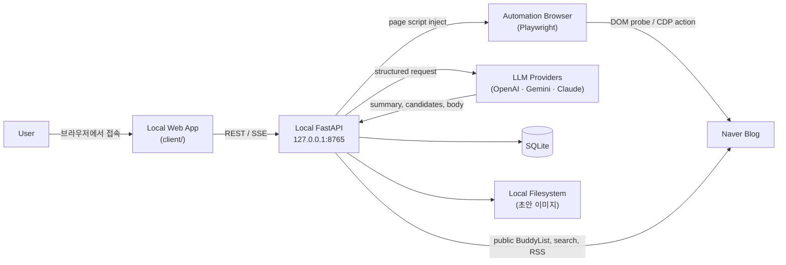

# 네이버 블로그 댓글·글쓰기 보조 도구 아키텍처

Status: 현재 구현을 반영한 개정본, 갱신 2026-08-11

이 문서는 v0.6 이후의 실제 런타임 구조와 현재 웹앱 UX 계약을 기술합니다. 사용자용 설치·운영
절차는 [`getting-started.md`](getting-started.md)와 [`local-operations.md`](local-operations.md)를,
현재 화면과 반응형·접근성 기준은 [`ux-design.md`](ux-design.md)를 기준으로 삼습니다.
[`archive/webapp-experience-redesign-plan.md`](archive/webapp-experience-redesign-plan.md)는
PR #90~#91의 원래 실행 기록과 #96~#105 closure snapshot을 함께 보관하며, PR 1~8이 만든
원래 Side Panel 아키텍처와 delivery boundary는 [`archive/delivery-plan.md`](archive/delivery-plan.md)에
보관되어 있습니다. archive 문서는 현재 구현의 변경 기준이 아닙니다.

## 목적과 경계

이 도구는 한 명의 로컬 사용자가 네이버 블로그 이웃 글을 발견하고, 관련 댓글을 생성·편집하며,
공감·댓글 등록·서로이웃 신청을 수행하고, 별도 워크플로로 자기 블로그 글을 작성하는 과정을
돕습니다.

탐색 대기열은 저장된 블로그 ID 하나와 선택적 검색어, 수동 추가 이웃을 사용합니다. 활성화되면
공개 BuddyList, 네이버 검색 API, RSS metadata endpoint만 읽습니다. 쿠키·로그인 정보를
수집하거나 Captcha를 우회하지 않으며, 무인 배치는 명시적 opt-in 없이 동작하지 않습니다.

## 시스템 구조



FastAPI는 `127.0.0.1:8765`에만 bind합니다. **`client/` 로컬 웹앱**이 유일한 end-user
UI입니다. Python 패키지는 loopback 서비스와 SPA를 함께 제공하며
별도 프레젠테이션 프로세스는 필요하지 않습니다.

## 구성 요소 책임

### 로컬 웹앱 (`client/`)

TypeScript SPA로 빌드되며 같은 loopback 서비스에서 static으로 제공됩니다. CORS 추가
설정 없이 같은 origin에서 API를 호출합니다.

워크스페이스의 primary navigation은 **홈(Home)**, **작업함(Workbench)**, **글쓰기(Writing)**,
**관리(Management)** 네 항목이며, 한 번에 하나만 표시합니다. 화면의 네 번째 label은 `관리`지만
호환성을 위해 DOM의 `data-section="more"`와 `more` route 이름은 유지합니다. 세션 배치, 이력,
일반 설정은 작업함과 관리의 보조 화면으로 열립니다.

- **App shell** — `client/public/index.html`의 skip link, semantic header/nav, `#workspace` main을
  소유합니다. nav는 workspace 밖에 있어 view rerender 뒤에도 유지되며, 현재 section은
  `aria-current="page"`로 표시합니다.
- **Home** — readiness blocker, 오늘의 queue metric, 작업함·새 글 quick action을 보여 주는
  작은 dashboard입니다. blocker가 있으면 단일 primary action으로 `#setup` guided onboarding을
  열고, 준비가 끝나면 작업함 또는 새 글 흐름으로 보냅니다.
- **Workbench** — readiness, 탐색 대기열, queue filtering/cursor, 개별 글 처리와 session batch
  preflight를 소유합니다. 긴 queue는 home에 복제하지 않습니다.
- **Onboarding** — `#setup`/`#onboarding`의 단계형 readiness checklist입니다. 현재 단계의
  설정 section deep-link, browser session launch/focus, refresh, home 복귀를 위임받습니다.
- **Comment** — 추출 뒤 기본 후보를 생성하고, 선택·AI 빠른 다듬기·복사·한 번의 실행 승인을 제공합니다.
- **Session** — 세션 배치 승인, safety preflight, SSE 기반 진행 추적, 취소와 작업함 복귀를
  소유합니다.
- **Writing** — seed form과 recent drafts, block canvas, title·block working copy autosave,
  revision checkpoint, AI compose/refine/tag, 이미지·태그·임시저장 실행을 소유합니다.
- **Management** — `#more`의 이력·설정·PC 전용 태블릿 연결 entry입니다. 설정은 defaults,
  automation, connections 세 section과 필요한 경우에만 펼치는 progressive disclosure panel로
  구성됩니다.

SPA는 secret이나 API key를 보유하지 않으며, LLM provider 설정 여부만 표시합니다.

### Shell·route 계약

`main.ts`는 하나의 `#workspace` root에 controller를 조립하고 hash를 화면 소유 section으로
해석합니다. primary tab과 내부 화면을 분리해 legacy bookmark를 보존합니다.

| Route | 소유 화면 | 호환 별칭·비고 |
| --- | --- | --- |
| `#home` | 홈 dashboard | `#today`는 home의 legacy alias |
| `#workbench` | 작업함 queue | `#queue`, `#batch` alias; `#post/:id`는 선택 글 detail |
| `#setup` | 초기 설정 가이드 | `#onboarding` alias; 완료 뒤 홈으로 복귀 |
| `#writing` | 새 글 seed/editor | `#writing/:draftId`는 특정 초안 재개 |
| `#more` | 관리 entry | `#menu`, `#devices`, `#pairing` 등 legacy route가 관리로 귀속 |
| `#activity` | 이력 | `#history`, `#logs` alias; 관리 tab을 current로 유지 |
| `#settings?section=...` | 설정 | `defaults`, `automation`, `connections`; 관리 tab을 current로 유지 |
| `#session[/id]` | batch 진행 화면 | 작업함 tab을 current로 유지 |
| `#comment/:id` | 저장된 댓글 결과 | 작업함 context를 유지하고 stale recommendation 응답을 버림 |

화면 전환은 `activeView`를 먼저 갱신하고 route·nav·controller view를 함께 갱신합니다. 전환 시에는
workspace로 focus를 옮기지만, 같은 화면의 state rerender에서는 입력 focus를 훔치지 않습니다.
`#workspace`에는 전체 화면을 덮는 `aria-live`를 두지 않고, 각 view가 필요한 status live region만
소유합니다.

### Controller·state 소유권

서버 응답은 controller가 API 경계에서 받아 state pure helper로 정규화한 뒤 view에 전달합니다.
view는 DOM을 그리며 callback만 호출하고, route 변경·network·SSE·busy guard를 직접 소유하지
않습니다.

| 영역 | state/controller 책임 | 주요 보호 규칙 |
| --- | --- | --- |
| Home/Workbench/Onboarding | `TodayState`, `TodayController` | readiness·queue·safety·browser session을 함께 로드하고, busy 중 최신 `selectedPostId` 의도를 pending으로 보존합니다. queue filter reset은 query/source/state/sort만 되돌리고 selection·posts를 보존합니다. |
| Comment | `CommentState`, `CommentController` | post/content sequence로 이전 글의 generation·restore·refine 응답을 현재 글에 적용하지 않습니다. |
| Session | `SessionState`, `SessionController` | lifecycle와 stream generation으로 close/새 session 이후 응답을 무시하고, SSE payload의 session id를 확인합니다. terminal event에서는 source를 닫고, bounded reconnect 뒤 한 번의 read fallback만 수행합니다. |
| Engagement run | `RunState`, `RunController` | run id와 lifecycle을 확인하며 중복 start/manual completion을 막습니다. terminal stream은 닫고 늦은 refresh를 현재 run에만 적용합니다. |
| Writing | `WritingState`, `WritingController` | draft id·load/refresh sequence·`isActive`를 확인합니다. autosave timer/in-flight/queued request를 draft에 결박하고, stale response는 canvas를 덮지 않는 metadata acknowledgement로 축소합니다. terminal staging refresh도 같은 draft에서만 적용합니다. |
| Settings | `SettingsState`, `SettingsController` | 한 번에 하나의 load/save/sync/restart만 허용하며 form snapshot이 로드·저장 중 사용자의 변경을 덮지 않게 합니다. `expandedPanels`와 `data-settings-panel`로 progressive disclosure 상태를 rerender 뒤 유지합니다. |

모든 비동기 action은 `try/catch/finally`에서 busy 상태를 해제하고, 실패를 사용자가 다음 행동으로
복구할 수 있는 message/notice로 변환합니다. stale 응답은 성공·실패 어느 쪽도 현재 화면에
전파하지 않는 것이 기본 불변 조건입니다.

### Page Script Injection (`client/src/page/`)

자동화 브라우저(Playwright)의 isolated context에 `window.__nbaPage`로 주입되는 read-only
probe 번들입니다. 기사 추출, 댓글·공감·서로이웃 popup probe, 에디터 probe, 내 블로그 카테고리
읽기 등 DOM 관측만 담당합니다. CDP를 통한 클릭·입력은 Python 레이어가 probe 결과를 확인한 뒤
trusted input으로 실행합니다.

### Local API, Domain, Persistence

FastAPI는 체크인된 [`api/openapi.yaml`](api/openapi.yaml) 계약, 입력 검증, request-size
제한, exact-origin CORS, local rate limiting, timeout 처리, redacted 로그를 소유합니다.
application과 domain 레이어는 FastAPI, Chrome, SQLAlchemy, 어떤 LLM SDK에도 의존하지
않습니다.

SQLite는 추천(recommendations), 교류 실행(engagement runs), 탐색 큐(discovery posts),
세션 배치(automation sessions), 사용자가 작성한 초안(post drafts)과 그 revision·tag·이미지
metadata, 설정(app settings), LLM 호출 기록(call attempts)의 정식 소유자입니다. 탐색 대상의
원문 전체와 provider credential은 저장하지 않습니다. 사용자가 만든 초안의 canonical blocks와
working copy는 재개·충돌 복구를 위해 저장됩니다.

### 다중 LLM Provider 구조

```
infrastructure/llm/
├── registry.py        — ProviderRegistry
├── openai_client.py   — OpenAIStructuredClient
├── gemini_client.py   — GeminiStructuredClient
├── anthropic_client.py — AnthropicStructuredClient
└── fake_client.py     — FakeStructuredClient (테스트·기본)
```

**`ProviderRegistry`**는 프로세스 환경에서 API key를 읽고, 어떤 provider가 호출 가능한지
보고하며, 요청 시 client를 캐싱해 반환합니다. Key 값은 response나 로그에 절대 노출하지
않으며, SPA에는 `configured: bool` 여부만 반환합니다.

각 adapter는 공통 `StructuredCompletion` port를 구현하며, Pydantic Structured Outputs를
사용해 결과를 검증합니다.

| Provider | 환경변수 | 기본 model |
| --- | --- | --- |
| OpenAI | `OPENAI_API_KEY` | `gpt-5.6-terra` |
| Gemini | `GEMINI_API_KEY` | `gemini-3.6-flash` |
| Claude | `ANTHROPIC_API_KEY` | `claude-sonnet-5-20260514` |

**Fan-out (`application/llm/fanout.py`)**는 하나의 요청을 여러 provider에 병렬 호출해
결과를 비교합니다. 각 provider에 독립적인 idempotency key가 파생되므로 재시도 시 이미
저장된 결과를 재생합니다. 부분 실패는 정상이며, 한 provider의 거부가 다른 provider의
성공 결과를 무효화하지 않습니다.

**`CallBudget` (`application/llm/budget.py`)**는 fan-out이 시작되기 전에 두 가지 한도를
확인합니다:

1. **`per_request_provider_cap`** — 한 요청이 동시에 호출할 수 있는 provider 수.
2. **`daily_call_cap`** — 이 설치가 하루에 사용할 수 있는 총 provider 호출 수.

한도를 초과하면 `BudgetExceededError`를 반환하며 어떤 provider도 호출하지 않습니다.
두 값은 `settings/`에서 구성합니다.

### 글쓰기 Domain

글쓰기 워크플로는 다음 domain 개체를 사용합니다:

- **`PostDraft`** — 초안의 lifecycle을 소유합니다. 상태는 `collecting → composed →
  refining → tagged → staging → staged`로 전진하며, `abandoned`로의 명시 전환만
  예외입니다.
- **`DraftRevision`** — 한 번의 생성·다듬기·사용자 편집 결과. `seed`, `composed`,
  `refined`, `user_edited` 네 kind가 있으며 draft에 여러 revision이 쌓입니다.
- **`BodyBlock`** — 본문은 HTML이 아니라 block 배열입니다. 에디터 입력은 block 단위로
  실행하며, 같은 콘텐츠를 다른 에디터로 옮길 수 있습니다.
- **`DraftTag`** — 정규화된 태그. `generated`와 `user` 소스를 구분하며 선택 상태를
  관리합니다.
- **`PublishRun`** — 에디터 임시저장 step machine. `title → body → images → tags →
  save` 5단계로 진행하며, engagement run과 같은 forward-only 전이를 따릅니다.

`ComposePost` use case는 참고 글 본문(최대 4,000자 × `reference_post_count`건)과
초안 seed text를 LLM provider에 보내 본문을 생성합니다. 다듬기는 기존 body를 입력으로
같은 port를 호출합니다. 태그 생성도 동일한 경로를 사용합니다.

#### Editor workspace 계약

글쓰기 화면은 시작 상태와 editor 상태를 분리합니다.

- 시작 상태는 제목·메모·카테고리 seed form과 최근 초안 목록을 함께 보여 줍니다. `초안만 저장`
  과 `AI로 초안 완성`은 제목과 메모가 유효할 때만 활성화됩니다.
- editor 상태는 본문을 textarea 하나로 평탄화하지 않고 `BodyBlock[]` canvas로 유지합니다.
  문단·소제목·인용·순서/비순서 목록·구분선·이미지와 caption을 block 단위로 편집합니다.
- 본문 옆에는 최근 초안, AI 도구, 이미지, 태그, 변경 기록, 임시저장 panel이 `details`로
  배치됩니다. panel은 기본적으로 필요한 항목만 열리고, `data-writing-panel` open 상태는
  rerender 뒤 복원됩니다.
- 제목·본문 변경은 700ms debounce working-copy autosave를 사용합니다. 빈 제목·persistable하지
  않은 본문은 API를 호출하지 않으며, title-only collecting draft는 title patch로 저장할 수
  있습니다. autosave는 revision을 만들지 않습니다.
- active revision과 현재 canvas가 다르면 compose/refine/tag/stage 같은 서버 작업을 잠그고
  먼저 `버전으로 남기기`를 요구합니다. checkpoint는 변경이 있을 때만 호출하며, 임시저장
  실행은 최신 working copy가 확정된 뒤 시작합니다.
- 자동저장 conflict나 실패에서는 local title·blocks를 보존하고, 사용자가 새 편집 또는 명시적
  저장으로 재시도할 수 있게 합니다. `새 글 시작`과 다른 초안 열기는 예약·in-flight 저장이
  끝나기 전에는 차단하여 이전 초안의 변경이 유실되지 않게 합니다.
- `start-new-draft-button`, `draft-title`, `seed-title`, `data-focus-key`와 block selector를
  이용해 구조 변경·option selection·image insertion 뒤에도 입력 focus와 selection을 가능한
  한 복구합니다. 비활성 control은 async action이 끝난 후에만 focus를 복원합니다.

#### Progressive settings 계약

설정은 하나의 긴 form 대신 세 개의 목적 기반 section으로 나뉩니다.

1. `defaults`: 댓글과 글쓰기 기본값.
2. `automation`: blog ID, 수집원, consent/safety, schedule과 AI budget.
3. `connections`: AI·Naver Search·SMTP·browser·LAN 및 PC 전용 data management.

각 section의 summary는 현재 상태와 다음 행동을 먼저 보여 주고, 세부 입력은 `details[data-settings-panel]`
안에 둡니다. 패널을 펼친 뒤 저장·실패·reload가 발생해도 controller의 `expandedPanels`와 form
snapshot이 열림 상태와 사용자의 미저장 입력을 보존합니다. 비밀값은 write-only input으로만
전달되며 성공 응답에도 값을 다시 채우지 않습니다. paired tablet에서는 connections와 data
management의 PC 전용 값을 노출하지 않습니다.

### 세션 배치 (`RunSession`, `SessionPostRunner`)

**`RunSession`**은 하나의 승인으로 여러 글을 순서대로 처리하는 batch orchestrator입니다.
승인 시점에 `automation_session_posts`에 대상 UUID와 순서를 snapshot으로 저장하고, 실행 중
대기열이 바뀌어도 이 snapshot만 사용합니다. 각 글 사이에 `SafetyGovernor`가 판정을 수행합니다.

- 사용자가 승인한 `max_posts`건까지 처리하며 하나도 초과하지 않습니다.
- 취소 요청은 현재 글이 끝난 뒤 반영됩니다.
- 진행 상태는 SSE event stream으로 client에 전달됩니다.
- 종료된 세션은 새 승인 없이 재개되지 않습니다.
- process가 다시 시작되면 이전 pending/running session은 `process_restarted` abort 상태가 됩니다.
  브라우저의 실제 마지막 동작을 재추측하거나 자동 재개하지 않습니다.

**`SessionPostRunner`**는 한 글에서 추출 → 댓글 생성 → 첫 후보 승인 → 교류 실행을
순서대로 수행합니다. 각 실패는 result code로 기록되며 batch가 계속할지 중단할지를
`RunSession`이 판단합니다.

### SafetyGovernor

`SafetyGovernor`는 모든 외부 행동 전에 다음 조건을 확인합니다:

| 판정 사유 | 조건 |
| --- | --- |
| `daily_cap_reached` | 공감·댓글·서로이웃 각각의 일일 상한 초과 |
| `outside_allowed_hours` | 현재 시각이 허용 시간대(`allowed_hours`) 밖 |
| `consecutive_failures` | 연속 실패 횟수가 `max_consecutive_failures`에 도달 |

추가로 글 사이 **최소 간격**(`min_interval_seconds`)과 **jitter**(`jitter_ratio`)를
적용하며, 기사 길이에 비례하는 **dwell time**을 계산합니다.

거부 시 `GovernorRefusedError`가 발생하며 session은 abort 상태로 전이합니다.
`GET /api/v1/automation/safety-status`는 action별 cap·사용·잔여량과 현재 시간/실패 gate를
반환합니다. 웹앱은 사용자가 선택한 단계와 대상 수만 이 상태에 대입해 시작 전 범위를 표시하며,
서버는 각 글을 실행하기 직전에 같은 governor를 다시 확인합니다.

### 무인 스케줄 (`ScheduleSessions`)

무인 실행은 opt-in이며 다음 세 조건을 모두 충족해야 활성화됩니다:

1. `settings/automation_consent`에서 `accepted: true`.
2. `settings/safety_policy`가 한 번 이상 명시적으로 저장됨(`updated_at ≠ null`).
3. `settings/schedule_policy`의 `mode`가 `"schedule"`.

세 조건을 충족하면 `ScheduleSessions.run_if_due()`가 매일 지정 시각(±5분)에 호출됩니다.
자동으로 browser session을 시작하고 `SessionTrigger.SCHEDULE`로 세션을 승인합니다.

안전 장치:
- 하루에 한 번만 실행됨(같은 날 `SessionTrigger.SCHEDULE`로 생성된 세션이 이미 있으면
  건너뜀).
- 다른 세션이 활성 상태이면 건너뜀.
- 브라우저를 시작하지 못하면 건너뜀.
- 하나라도 누락된 조건이 있으면 `ScheduleDecision(started=False, reason=...)`을
  반환하며 아무 작업도 하지 않음.

## 상태 소유와 데이터 수명

| 상태 | 소유자 | 수명 |
| --- | --- | --- |
| Blog DOM | Automation Browser tab | 페이지 수명 |
| 추출된 전체 본문 | FastAPI 메모리 | 해당 작업이 완료되거나 프로세스 종료 시 해제 |
| 참고 글 본문 (글쓰기용) | FastAPI 메모리 → LLM provider 전송 | generation 완료 시 해제 |
| SPA UI 상태 | 브라우저 메모리 | 탭 수명 |
| 추천·교류 실행·세션·초안·설정 | SQLite | 명시 삭제까지 |
| 초안 이미지 bytes | 앱 소유 database 인접 `media/` filesystem | 초안 삭제까지 |
| LLM API Key | Python process 환경변수 | 프로세스 수명 |
| `NAVER_SEARCH_CLIENT_ID`/`SECRET` | Python process 환경변수 | 프로세스 수명 |
| LLM 호출 기록 (attempts) | SQLite | 예산 계산용, 일별 |
| 세션 배치 진행·SSE event | 메모리 + SQLite | 세션 종료까지 |

## 보안과 개인정보 경계

- **LLM API key는 Python 프로세스 환경에만 존재합니다.** 어떤 경우에도 client(SPA),
  response body, 로그, 브라우저 storage에 전달되지 않습니다. SPA에는 `configured: bool`
  여부만 반환합니다.
- **참고 글 본문은 LLM provider로 전송됩니다.** 글쓰기의 `ComposePost`와 `RefinePost`는
  내 블로그 참고 글 본문(최대 4,000자 × 설정된 건수)을 provider에 전달합니다. 댓글
  생성 시에도 대상 글 본문이 provider에 전달됩니다. 전송된 본문은 SQLite나 로그에
  저장되지 않습니다.
- **초안 이미지는 로컬 filesystem에만 존재합니다.** `DraftImageStore`가 열려 있는 SQLite database
  인접의 앱 소유 `media/` directory에 generated UUID 이름으로 저장합니다. 웹 UI와 runtime API는
  storage path를 받지 않습니다.
  원본 파일명은 sanitize되며, response에 bytes가 포함되지 않습니다. `use_image_vision:
  true`를 설정한 경우에만 이미지가 provider에 전달됩니다.
- FastAPI는 기본적으로 loopback에 bind하며, HTTP Origin이 service origin과 다르면 거부합니다.
  브라우저 credentials는 paired private-LAN session에만 사용합니다.
- `blog.naver.com`과 `m.blog.naver.com` HTTPS URL만 초기 허용 대상입니다.
- 자동화 브라우저는 전용 profile을 사용하며 기존 브라우저와 분리됩니다. 쿠키·계정
  정보를 읽지 않고, 공개 페이지의 sign-in affordance만 관찰합니다.
- Request body, authorization header, 기사 본문, provider payload는 로그·브라우저
  storage·테스트 artifact·스크린샷에서 제외됩니다.
- Client abort나 탭 닫기 시 브라우저 reference는 해제되나, 이미 실행 중인 FastAPI/
  provider 작업의 취소는 보장하지 않습니다.

## 런타임과 품질 전략

Python 3.14, `uv`, FastAPI, SQLAlchemy, Alembic, SQLite가 서비스를 구성합니다.
`client/`는 Node.js 24 LTS, TypeScript, esbuild, Biome, Vitest로 빌드합니다.
자동화 브라우저는 Playwright입니다.

PR CI는 Ruff, ty, pytest(87% branch coverage 이상), TypeScript 검사, Biome, Vitest
coverage, web-app production build, 설치된 wheel smoke test, 별도 System E2E
workflow를 실행합니다. Fixture는 합성 HTML만 포함하며, 실제 Naver 페이지나 live LLM
호출은 opt-in입니다.

현재 client 회귀 범위는 앱 셸·home·onboarding·workbench·writing editor·settings·async
lifecycle guard를 포함합니다. packaged E2E는 desktop, 768px portrait, 1024px landscape에서
navigation, queue/detail, writing interaction, settings disclosure, focus와 horizontal overflow를
DOM/metric으로 확인합니다.

비동기 회귀 테스트는 다음 불변 조건을 특히 확인합니다.

- route/session/draft identity가 바뀐 뒤 이전 load, API, SSE 응답이 현재 화면·다른 초안을
  갱신하지 않습니다.
- terminal SSE 뒤 source를 닫아 EventSource가 종료된 실행에 재연결하지 않습니다.
- busy 중 중복 start/save/stage를 만들지 않고, failure 뒤 사용자가 다시 시도할 수 있습니다.
- rerender는 입력 focus, panel open state, local canvas를 보존하며 전체 `#workspace`를 live region으로
  만들지 않습니다.

## 결과

- API key가 SPA에 노출되지 않으면서도 같은 loopback에서 모든 기능을 제공합니다.
- 여러 LLM provider를 동시 비교할 수 있으면서도 예산 제한으로 비용을 통제합니다.
- 세션 배치와 무인 스케줄은 항상 SafetyGovernor를 거치며 일일 상한과 시간대를
  준수합니다.
- 글쓰기 워크플로는 임시저장까지만 자동화하며 발행은 사용자가 직접 수행합니다.
- OpenAPI가 SPA-to-service의 단일 진실 소스이며, 비호환 변경은 새 API version을
  요구합니다.
