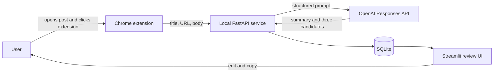

# Browser-Assisted Comment Recommendation Architecture

Status: Accepted on 2026-07-16

## Purpose and Scope

The application helps one local user create relevant comment drafts for a Naver Blog post.
The user opens a post, invokes the browser extension, verifies the extracted content, and
requests recommendations. The user remains responsible for editing and publishing a comment.

The first release does not monitor blogs, traverse posts, sign in, click reactions, or publish
comments. It processes only the active page after an explicit user action.

## System Context



All Python services run on the user's machine. FastAPI listens only on `127.0.0.1:8765`.
Streamlit is a separate process and reads recommendations through the application layer rather
than calling FastAPI internally.

## Component Responsibilities

### Chrome Extension

The Manifest V3 extension is written in TypeScript. It requests only `activeTab`, `scripting`,
and the loopback API host permission. Opening the popup grants temporary access to the current
tab. The extension:

1. rejects unsupported or non-HTTPS URLs;
2. executes extraction in available frames;
3. ranks article candidates and normalizes visible text;
4. shows the title, character count, and preview before transmission; and
5. sends one recommendation request with a UUID idempotency key.

Naver-specific selectors are isolated behind an extractor adapter. A generic semantic fallback
handles minor markup changes. The extension never reads cookies, browser history, or unrelated
tabs and does not run on a timer.

### Local API

FastAPI owns the external contract defined in [`api/openapi.yaml`](api/openapi.yaml). Pydantic
models validate the URL and payload before the application use case runs. The service applies a
request-size limit, exact extension-origin CORS policy, local rate limit, and redacted logging.

Recommendation generation is synchronous in the first release. This keeps full article text in
memory only and avoids a durable job queue containing copied content. An idempotency record stores
the request hash and completed response so safe retries do not repeat a successful model call.

### Application and Domain

Business logic has no dependency on FastAPI, Streamlit, SQLAlchemy, or OpenAI. Proposed modules:

```text
src/naver_blog_assistant/
├── domain/          # BlogPost, Recommendation, Candidate, ReviewStatus
├── application/     # generate, retrieve, and review use cases
├── ports/           # generator and repository protocols
├── infrastructure/  # OpenAI and SQLAlchemy adapters
├── api/             # FastAPI routes and transport schemas
└── ui/              # Streamlit pages and presenters
```

The OpenAI adapter uses the Responses API and Pydantic Structured Outputs. Its output contains a
short summary, key topics, and exactly three candidates. Provider refusals, timeouts, rate limits,
and invalid outputs are converted to stable application errors; provider messages are not exposed
to the extension.

### Persistence and Review UI

SQLite stores the canonical URL, title, content hash, short excerpt, summary, topics, candidates,
selected or edited comment, review status, timestamps, and non-secret generation metadata. It does
not store the complete article body. Alembic manages schema changes.

Streamlit lists recent recommendations and lets the user select, edit, copy, approve, and mark a
comment complete. No UI action publishes content to Naver.

## Security and Privacy Boundaries

- `OPENAI_API_KEY` exists only in the Python process environment.
- The extension origin is explicitly configured; wildcard CORS and credentials are disabled.
- Only `blog.naver.com` and `m.blog.naver.com` HTTPS URLs are accepted initially.
- Request bodies, cookies, authorization headers, and article text are excluded from logs.
- Full article text is discarded after generation, including on handled failure paths.
- Database files, environment files, extension builds, and browser profiles remain untracked.

The tool remains user-initiated extraction rather than an official Naver integration. Any broader
distribution or automated browsing requires a fresh policy and privacy review.

## Runtime and Quality Strategy

Python 3.14 with `uv` remains the primary environment. FastAPI, Uvicorn, and Alembic are added to
the existing OpenAI, Pydantic, SQLAlchemy, and Streamlit dependencies. The extension uses Node.js
24 LTS, TypeScript, esbuild, Biome, and Vitest.

Pull-request CI runs Ruff, ty, pytest with at least 85% branch coverage, TypeScript type checking,
Biome, Vitest coverage, and an extension production build. Tests use synthetic HTML and fake model
adapters. Real Naver pages and live OpenAI requests are opt-in smoke tests and never CI fixtures.

## Key Decisions and Consequences

- A browser extension replaces backend scraping, improving usability while preserving explicit
  user control. It adds a small TypeScript toolchain.
- FastAPI and Streamlit remain separate processes, keeping transport and UI concerns independent.
- Synchronous generation makes the popup wait for the model but avoids persisting source content.
- Pydantic is the source of truth for model output, and OpenAPI is the source of truth for the
  extension-to-service contract. Contract changes require compatibility tests.
