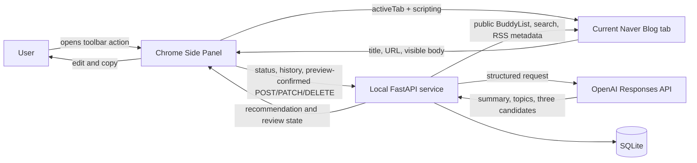

# Side Panel Comment Recommendation Architecture

Status: Accepted target architecture, updated 2026-07-22

This decision supersedes the earlier split review-UI architecture accepted on 2026-07-16.
PR 1~8 delivered the domain, SQLite persistence, local API, Side Panel extraction, OpenAI adapter,
integrated recommendation/review workflow, and release hardening. Delivery boundaries and their
acceptance criteria are recorded in [`delivery-plan.md`](delivery-plan.md).

## Purpose and Boundaries

The application helps one local user create a relevant comment draft for the Naver Blog post in
the active tab. The user opens the extension Side Panel, checks the extracted title and preview,
explicitly requests recommendations, edits or selects a candidate, and manually publishes it.

The application provides a local discovery queue using one explicitly saved own-blog ID, optional
saved search queries, and manually added neighbors. Once enabled, the local API reads only the
fixed public BuddyList, Naver search, and RSS metadata endpoints at the user's scheduled time. It
does not sign in, use cookies, click reactions, or publish comments. Every article extraction and
model request still starts with an explicit user action.

## System Context

FastAPI listens only on `127.0.0.1:8765`. The Side Panel is the only end-user UI. The Python
package provides the loopback service and contains no second presentation layer.

## Component Responsibilities

### Side Panel and Browser Boundary

The Manifest V3 TypeScript extension requests `activeTab`, `scripting`, `sidePanel`, `storage`, and
the loopback API host permission. It offers the two Naver Blog origins as an **optional** host
permission; accepting it makes article capture and comment-input assistance available after normal
navigation, while declining keeps the toolbar-click `activeTab` fallback. Storage holds no article,
generated candidate, or edited-comment text; it contains retry metadata and the user's explicitly
saved options, including one bounded closing phrase. The service worker configures toolbar clicks
to open the panel and performs only short browser-API orchestration. It never owns a model request
because its lifecycle is ephemeral.

The Side Panel owns UI and HTTP request lifecycles. On open, it extracts the active post and shows
the URL, title, character count, truncation state, and a bounded preview. Transmission begins only
after the user confirms relationship, speech style, comment mood, and comment length and presses the
generation button. A complete preference profile persists only after the user explicitly saves it as
the default. An optional 50-code-point closing phrase stays out of generation requests and is appended
in the local review editor only when a candidate is selected. The response echoes the effective options and non-blocking quality warnings so the
review UI can show provenance and weak role separation without hiding usable candidates. Direct
regeneration recaptures the article and, when its digest is unchanged, uses a fresh idempotency key
immediately; changed content returns to Preview. A separate settings action returns to Preview
without an API call. The panel then supports candidate selection, editing, approval, safe
comment-input filling, clipboard copy, and an explicit completed action. Filling or copying alone
never marks a recommendation completed. Copy uses the user gesture Clipboard API on a best-effort
basis and falls back to a selectable text area; the extension does not request `clipboardWrite`.
Input filling uses the user-granted Naver host permission or the existing `activeTab` and `scripting`
fallback, may click one verified standard comment-editor opener but never a submit control, and
proceeds only when exactly one visible editable target is empty. Ambiguous,
occupied, missing, stale, and denied targets fail closed.

A separate history controller reads runtime diagnostics and the latest 20 local recommendations.
It can copy a previously approved comment, open the original URL, or explicitly delete one local
record. History text stays in DOM memory and is never copied into `chrome.storage.local`.

Naver-specific selectors are isolated behind an extractor adapter. A generic semantic fallback
handles minor markup changes. Results from eligible frames are ranked, normalized, and bounded to
the API limit. The extractor returns strings only and excludes navigation and comments. An
unsupported URL, image-only post, short result, or changed DOM produces a local error without an
API call. Switching tabs or navigating marks the current preview stale. A different tab or origin
requires the user to click the toolbar action again to grant `activeTab`; stale asynchronous
results are discarded using the tab/document identity and an operation token. If neither permission
is available, the panel explains how to grant the optional Naver permission before retrying.

### Local API, Domain, and Persistence

FastAPI owns the checked-in [`api/openapi.yaml`](api/openapi.yaml) contract, input validation,
request-size control, exact-origin CORS, local rate limiting, timeout handling, and redacted logs.
The application and domain layers remain independent of FastAPI, Chrome, SQLAlchemy, and OpenAI.

SQLite is the canonical owner of recommendations and review status. It stores the canonical URL,
title, content hash, bounded excerpt, summary, topics, candidates, timestamps, and generation
metadata, but never the complete body. A bounded list endpoint returns history summaries without
excerpts, hashes, candidates, or full article bodies. Deleting one recommendation also deletes its
candidates and completed retry snapshot transactionally. A review conflict is recovered by
fetching the current recommendation before the user retries; ETag is still outside the local
single-user scope.

### OpenAI Adapter

The adapter uses the Responses API with Pydantic Structured Outputs. The default model is
`gpt-5.6-terra`, with low reasoning effort and provider storage disabled using `store=false`.
Configuration may override the model without weakening output validation. Article content is
untrusted data: the entire provider input channel remains untrusted even when article text contains
delimiter-like strings. Validated preference enums select static relationship, speech, and target
length directives in trusted instructions; raw article fields cannot redefine those directives.
When the user enables personalization, at most five explicitly eligible completed comments are sent
as a separate untrusted style-example input. They can influence surface style only; their facts and
wording are not instructions or grounding.

The result contains a short summary, one to five topics, and exactly three grounded candidates in
the warm, curious, and supportive tones. Refusals, rate limits, timeouts, unavailable providers,
and invalid outputs map to stable application errors; raw provider payloads are never returned.

## State Ownership and Data Lifetime

| State | Owner | Lifetime |
| --- | --- | --- |
| Blog DOM | Active tab | Page lifetime |
| Full extracted body | Side Panel memory | References released on handoff, cancel, panel unload, or navigation |
| Full request body | FastAPI generation task | Released when that task settles or the process exits |
| Loading, preview, and unsaved edit state | Side Panel | Panel session |
| Recommendation, review status, and recent-history source | SQLite | Until individually or globally removed |
| Eligible completed-comment style examples | SQLite/OpenAI request | Until excluded; at most five per enabled generation |
| `OPENAI_API_KEY` | Python process environment | Process lifetime |
| Request fingerprint, idempotency UUID, result ID | Bounded extension storage | Retry window only |
| Explicitly saved generation profile and bounded closing phrase | Extension storage | Until changed or extension data is removed |

The extension stores no body, title, URL, generated candidate, edited comment, cookie, or credential. Its
`chrome.storage.local` is restricted to trusted extension contexts. Its registry contains only a
schema and generation-policy versions, digest, opaque IDs, state, and timestamps; a separate
versioned record contains the five validated generation preference enums and one normalized user-authored
closing phrase of at most 50 code points. It persists across browser
restarts and holds at most 20 operations.
Completed, released, or explicitly dismissed entries expire after 60 minutes and are removed on a
later registry access. Active, reviewing, terminal-failure, or indeterminate entries never expire
automatically. If 20 retained entries fill the registry, new generation is blocked until entries
expire or the user explicitly resolves, replaces, dismisses, or cleans them up. Invalid records are
quarantined from automatic retry and require cleanup confirmation. Reopening can repeat the same
request only when the same normalized payload can be extracted again; otherwise it can use a known
recommendation ID for GET or show manual recovery guidance.

## Idempotency and Failure Recovery

The extension normalizes whitespace in URL, title, and body using the shared contract, applies the
100,000-code-point limit, serializes `{source_url,title,body}` in a canonical key order, and hashes
its UTF-8 bytes. Every request uses a `generation-policy-v3` canonical JSON composite of that post
digest and all five effective preference values, so an old-policy result or differently configured
generation cannot be replayed. A non-empty legacy registry is quarantined until explicit cleanup;
only an empty legacy registry is migrated automatically. The extension persists the new digest and
UUID before sending `POST /api/v1/recommendations`.
Unicode and emoji test vectors keep the TypeScript and Python identity rules aligned. Duplicate
clicks, network interruption, or a `504` reuse that key whenever the same payload is available. A
completed generation returns the immutable first response; an active one returns
`generation_in_progress`. The panel stops bounded polling within 60 seconds and then presents an
unknown/manual-recovery state. A `429` honors `Retry-After`.

A failure known to occur before provider work releases the reservation and can be retried with the
same key. A terminal provider result such as refusal or invalid structured output is persisted as a
safe error snapshot and replayed without another model call. A timeout, connection loss, or server
failure after submission is indeterminate and is persisted separately from active generation. The
UI explains this state and must not silently issue a new key. Creating a replacement attempt
requires explicit user confirmation after the user understands that the prior provider result is
unknown.

If review returns `409`, the panel fetches the latest stored recommendation and does not overwrite
it automatically. Without ETag/`If-Match`, the MVP assumes one active panel and does not guarantee
protection from sequential stale writes across multiple panels. If clipboard access fails, the
comment remains selectable for manual copying.

## Security and Privacy Boundaries

- `OPENAI_API_KEY` exists only in the Python process environment.
- FastAPI binds only to loopback; wildcard CORS and browser credentials are disabled.
- CORS protects the browser boundary but is not local-process authentication. The MVP assumes one
  trusted local machine; broader distribution requires a new authentication and privacy review.
- Only `blog.naver.com` and `m.blog.naver.com` HTTPS URLs are accepted initially.
- The extension uses no always-on content script, cookies, history access, or remote JavaScript.
  Persistent access to `blog.naver.com` and `m.blog.naver.com` is optional and requested only from
  the Side Panel through a user gesture.
- Request bodies, authorization headers, article text, and provider payloads are excluded from
  logs, browser storage, test artifacts, and screenshots.
- Source URL, title, and a bounded excerpt are retained locally and must be disclosed to the user.
- Client abort, navigation, or panel unload releases browser references but does not guarantee that
  an already-running FastAPI/provider task is cancelled; server memory is released when it settles.

The product remains an AI writing aid, not engagement automation. User-triggered input filling does
not submit the form. Any monitoring, automatic likes, automatic publishing, or multi-user hosted
deployment requires a fresh policy and security review.

## Runtime and Quality Strategy

Python 3.14 with `uv` runs FastAPI, the OpenAI adapter, SQLAlchemy, Alembic, and SQLite. The
extension uses Node.js 24 LTS, TypeScript, esbuild, Biome, and Vitest. The Side Panel owns all
end-user presentation and review interaction.

PR CI runs Ruff, ty, pytest with at least 85% branch coverage, TypeScript checking, Biome, Vitest
coverage, an extension production build, installed-wheel smoke tests, and a separate packaged
System E2E workflow against the installed console script. Fixtures contain only synthetic HTML.
Real Naver pages and live OpenAI calls remain opt-in and must not emit source text or secrets into
artifacts. Operational details and the headless Side Panel limitation are documented in
[`local-operations.md`](local-operations.md).

## Consequences

- The review flow stays beside the source post without exposing the API key to the extension.
- Existing domain, persistence, and API work remains usable; only the presentation decision is
  replaced.
- One local background service is still required, without a second UI process or duplicated
  presentation layer.
- The extension must manage stale-tab detection, retry identity, and accessible long-lived UI.
- OpenAPI remains the extension-to-service source of truth; incompatible changes require a new API
  version.
