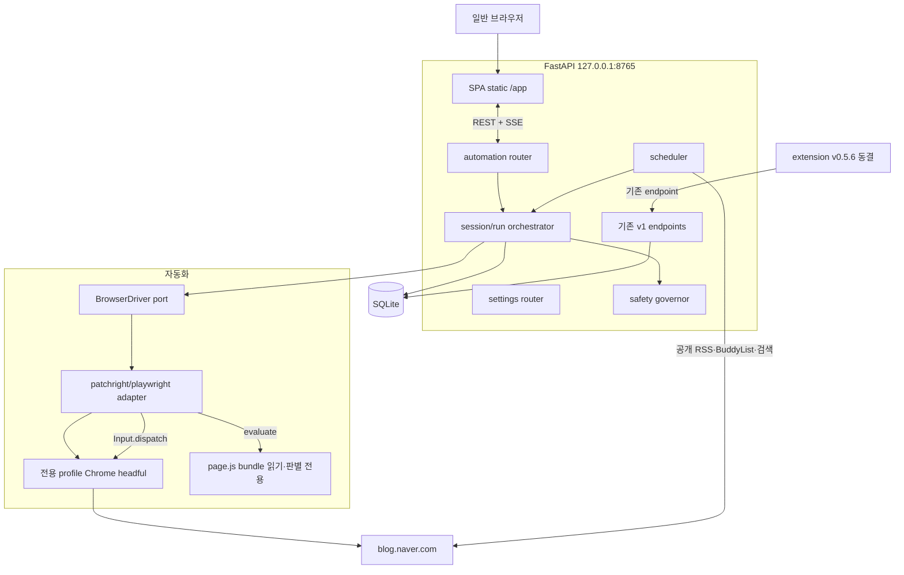
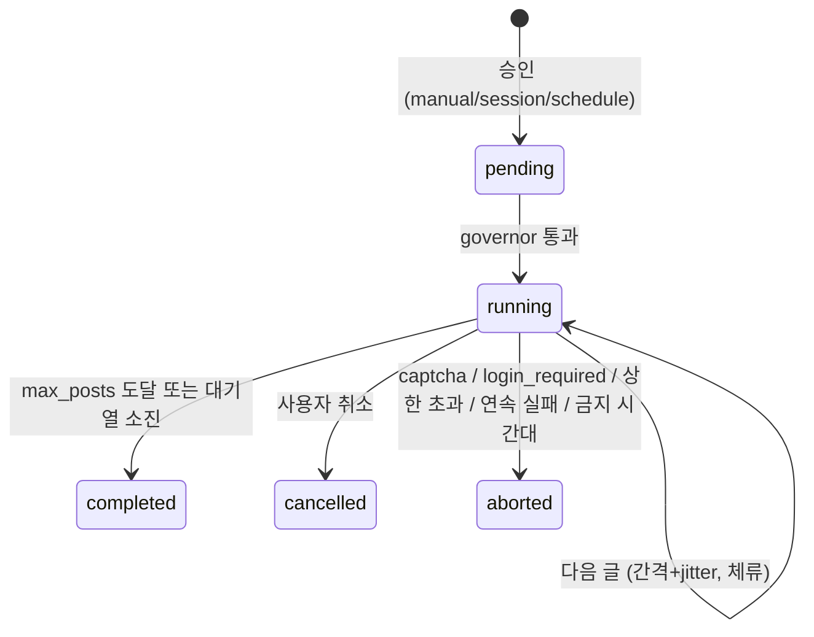
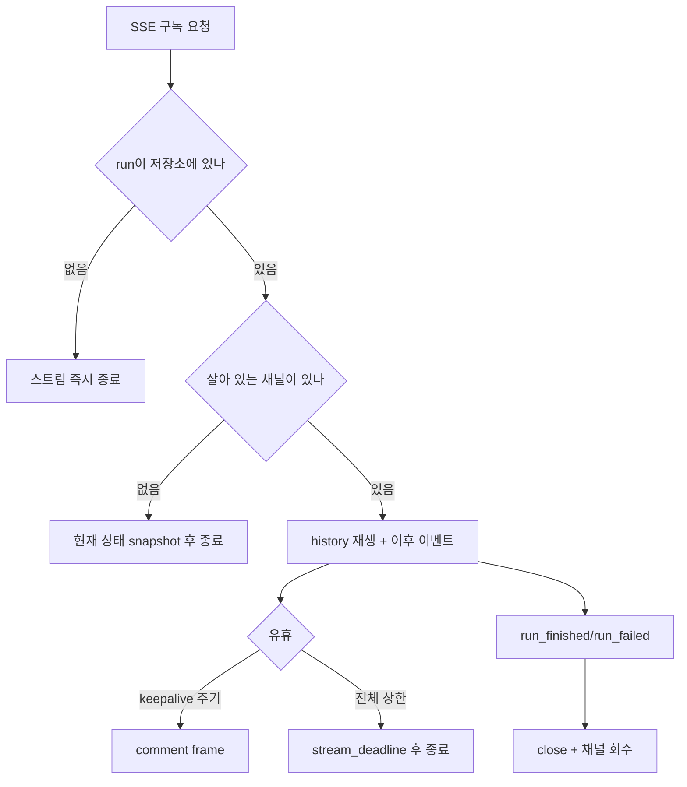
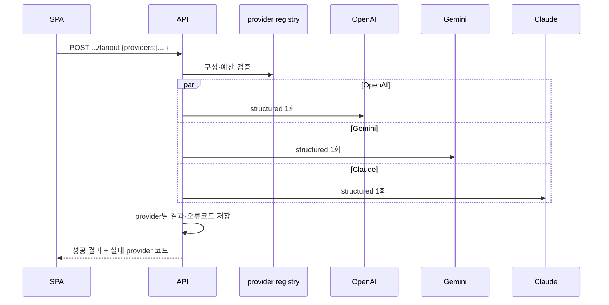
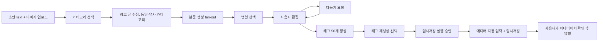
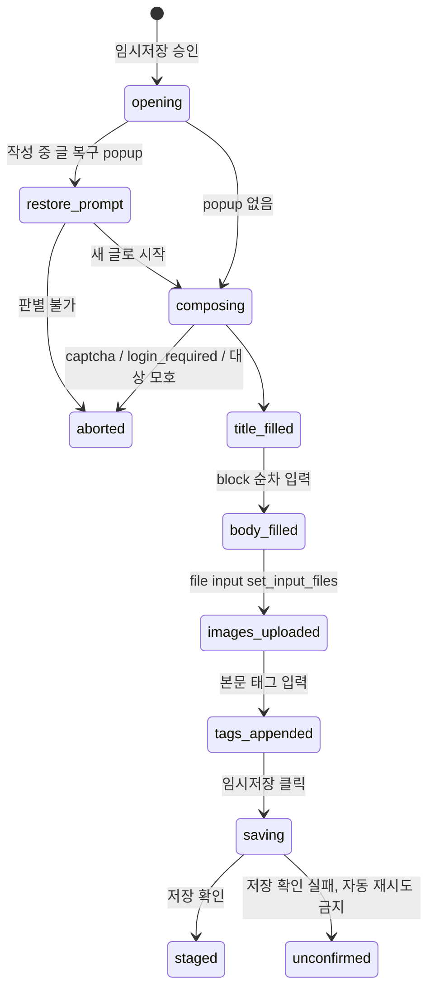

# 로컬 웹앱 + 브라우저 자동화 전환 Delivery Plan

Status: 진행 중, 2026-07-30 확정 · 2026-07-31 글쓰기 확장과 다중 provider 범위 통합

Chrome extension Side Panel을 로컬 웹앱으로 옮기고, DOM 조작을 backend가 소유한 Playwright 계열
browser session으로 대체하는 전환 계획입니다. 기존 Side Panel 아키텍처는
[`architecture.md`](architecture.md)에, 이전 배포 경계는 [`delivery-plan.md`](delivery-plan.md)와
[`v0.5.1-engagement-delivery-plan.md`](v0.5.1-engagement-delivery-plan.md)에 남아 있습니다.

2026-07-31에 범위를 통합했습니다. 이 문서는 위 전환 계획에 더해 두 가지를 함께 관리합니다. 첫째,
도구의 작업 범위를 "남의 글에 반응하기"에서 "내 글 쓰기"까지 확대하는 글 작성·다듬기·태그 생성·
임시저장 자동화입니다. 둘째, 생성 provider를 OpenAI 하나에서 OpenAI·Gemini·Anthropic Claude로
넓히고 여러 provider를 동시에 호출해 결과를 비교하는 fan-out입니다. 두 확장은 기존 automation
자산(browser session, page script probe, 단계 상태 기계, 서버 소유 idempotency)을 그대로 재사용하며,
동결된 extension v0.5.6의 계약을 건드리지 않습니다.

## 문제 정의

Chrome extension의 제약이 사용성과 확장성을 동시에 제한합니다. 좁은 Side Panel, MV3의 `activeTab`
user gesture 요구, service worker 수명, optional host permission 승인 흐름, extension ID와 CORS
origin 결합, unpacked 설치 절차가 그 목록입니다. 이를 FastAPI가 서빙하는 로컬 웹앱과 backend가
소유한 전용 profile browser session으로 옮기고, 승인 단위를 글 하나에서 세션으로 확대하며 최종적으로
무인 스케줄 실행까지 사용자가 선택할 수 있게 합니다. 기존 extension은 동결 상태로 계속 동작해야
합니다.

## 확정된 결정

| 항목 | 결정 |
| --- | --- |
| 실행 형태 | FastAPI가 서빙하는 로컬 웹앱 + backend가 소유한 전용 profile Chrome |
| 자동화 driver | `patchright` 기본, `playwright` fallback. `AUTOMATION_DRIVER` 설정으로 교체 |
| 동작 방식 | 읽기·판별은 isolated context evaluate, 클릭·입력은 CDP trusted input |
| 저장소 | 같은 저장소. `client/`와 automation 코드는 `extension/`을 참조하지 않아 이후 `git subtree split` 가능 |
| extension | v0.5.6 동결. 리팩터링하지 않음. 기존 table·endpoint 불변, 추가만 |
| 상태 저장 | 웹앱 상태는 SQLite 신규 table. extension의 `chrome.storage.local`은 그대로 유지 |
| 승인 모델 | `manual`(글 단위) → `session`(1차 목표) → `schedule`(최종, opt-in) |
| 참고 글 수집 | browser session으로 내 블로그 카테고리·글 목록을 읽어 캐시. 내부 XHR endpoint 호출 금지 |
| 발행 경계 | 임시저장까지만 자동. 발행은 사용자가 에디터에서 직접 클릭 |
| LLM provider | OpenAI + Gemini + Anthropic Claude. `StructuredCompletion` port 뒤에 둠 |
| 동시 호출 | 댓글·본문 생성은 provider fan-out 지원. 부분 실패 허용 |
| 태그 | 50개 생성·저장, 본문 삽입은 설정 가능한 상한까지 |
| 본문 표현 | HTML이 아닌 block 배열(`paragraph`/`heading`/`image`/`quote`) |
| Task 8 분할 | backend(PR 8)와 SPA(PR 9)를 분리 |
| 이미지 vision 전송 | draft 옵션, 기본값 off |

### 결정 근거

**Electron 대신 로컬 웹앱.** 최종 목표가 무인 실행이므로 browser는 "사용자가 보는 창"이 아니라
backend가 소유하는 실행 자원입니다. 웹앱 구성에서는 API process만 살아 있으면 스케줄 실행이
가능하지만, Electron 구성에서는 앱이 실행 중이어야 하고 Python API를 child process로 관리하며 두
runtime의 생명주기를 맞춰야 합니다. Electron의 유일한 실질 이점인 "한 창에서 다 보인다"는
screenshot streaming과 창 focus 버튼으로 대체할 수 있고, 웹앱을 나중에 shell로 감싸는 것은 포장
작업에 그칩니다. 역방향 전환은 비쌉니다.

**`patchright` 기본.** Python 3.14 classifier를 명시하고 있어(`Requires-Python >=3.10`, 1.61.2 기준)
`requires-python = ">=3.14,<3.15"` 제약에서 오히려 설치 위험이 낮습니다. `Runtime.enable` 누출
회피와 `--enable-automation` 제거를 제공하며, 우리 사용 패턴이 isolated context DOM 조작이라 Console
API 비활성과 isolated 기본값 제약을 거의 받지 않습니다. extension도 이미 `world: "ISOLATED"`를
사용했습니다. `BrowserDriver` port 뒤에 두므로 되돌릴 수 있는 결정입니다.

**같은 저장소 유지.** Python backend 48개 파일이 그대로 재사용되고, SQLite file과 Alembic head는 단일
소유여야 하며(두 저장소가 각자 migration chain으로 한 file을 건드리면 데이터가 깨집니다), 두 UI가
하나의 API process를 공유해야 병행 운영이 가능하고, CI·release·hook이 이미 구축돼 있습니다. 분리
가능성은 `client/`와 automation 코드가 `extension/`을 참조하지 않는 규칙으로 유지합니다.

**Task 8을 backend와 SPA로 분리.** 저장소 관례가 이미 계층별 분리(PR 3 client → 4 automation →
5 client → 6 api → 7 client)이고, backend 몫이 1,553줄이라 SPA를 합치면 리뷰 단위가 2,500줄을
넘습니다. SSE 수명주기 결함처럼 backend 단독 리뷰가 필요한 문제가 화면 코드와 섞이면 놓칩니다.
backend를 먼저 병합하면 이미 작성된 코드의 유실 위험도 사라집니다.

**provider 추상화를 글쓰기 기능보다 먼저.** 본문 생성·다듬기·태그가 모두 fan-out 대상이라 추상화를
먼저 세우지 않으면 OpenAI 전용 코드를 두 번 작성하게 됩니다.

**글쓰기를 세션 배치·governor보다 먼저.** 임시저장 경계의 글쓰기는 남의 계정에 작용하지 않아
governor 없이도 안전하고, 사용자 우선순위가 글쓰기에 있습니다.

**태그는 본문 태그 입력 기능으로 삽입.** 네이버 도움말 확인 결과 태그 입력 위치가 발행 영역과 본문
두 곳입니다. 임시저장 경계에서는 발행 레이어를 열지 않으므로, 문서 영역에서 `#태그명`을 입력하면
자동 추가되는 본문 태그 입력을 사용해 임시저장에도 태그가 보존되게 합니다. 카테고리도 발행 레이어
항목이므로 임시저장 단계에서는 설정하지 않고, 선택한 카테고리는 참고 글 수집과 화면 표시에만
사용합니다.

**이미지 vision 전송 기본 off.** 비용·프라이버시 예측 가능성을 우선하고, 사용자가 캡션을 주면 배치
품질이 충분합니다. draft 옵션으로 켤 수 있고 vision 지원 provider에만 보냅니다.

## 조사된 코드베이스 사실

- `src/naver_blog_assistant/` 48개 파일은 browser 비의존입니다. domain, application, SQLite(migration
  0001~0009), OpenAI adapter, discovery(BuddyList·RSS·검색 API·SMTP digest, FastAPI lifespan
  scheduler)가 그대로 재사용됩니다.
- `idempotency_records` table이 이미 서버에 있고 `Idempotency-Key` header와 `request_hash` 기반
  replay/conflict 의미를 서버가 소유합니다. extension의 `registry.ts`(388줄)는 서버 상태가 없던
  클라이언트를 보조한 것이므로 웹앱에서는 크게 단순화됩니다.
- `extension/src/browser/*`의 DOM 조작부(`probeLikeTarget`, `clickAndConfirmLikeTarget`,
  `naver-comment-publish-gateway.ts` 287줄, `naver-mutual-neighbor-gateway.ts` 1,080줄,
  `capture-current-frame.ts` 293줄)는 `chrome.scripting.executeScript` 직렬화 제약 때문에 helper를
  함수 내부에 중복 정의한 자기완결 함수입니다. `page.evaluate` 대상으로 이식 가능하며, 이식 시
  `isInteractable`·`readLikedState`·`findLikeTargets` 중복을 제거할 수 있습니다.
- `extension/src/api/client.ts`(1,403줄)는 순수 `fetch`입니다. `LOCAL_API_ORIGIN`만 상대 경로로 바꾸면
  SPA에서 재사용됩니다.
- `engagement_runs`(migration 0009)는 단계별 상태·결과 코드·forward-only 전이·`BEGIN IMMEDIATE`·unique
  제약을 이미 갖췄습니다. 자동화 엔진은 이를 재사용하고 trigger만 확장합니다.
- `scripts/cdp-evaluate.ps1`에 CDP `Runtime.evaluate` prototype이 있어 주입 방식이 검증돼 있습니다.
- 기존 OpenAPI 경로 20개는 수정하지 않습니다.

## 목표 아키텍처



## 디렉터리 구조

```
src/naver_blog_assistant/
├── api/
│   ├── factory.py                    # 기존. router 등록과 static mount만 추가
│   └── routers/                      # 신규
│       ├── automation.py             # session, extract, runs, sessions, SSE
│       ├── settings.py               # app_settings CRUD
│       └── spa.py                    # /app static mount
├── domain/
│   ├── automation.py                 # 신규: ActionOutcome, SessionPolicy, SafetyBudget, TriggerKind
│   └── (기존 models.py, discovery.py, engagement.py 불변)
├── ports/
│   ├── browser.py                    # 신규: BrowserDriver, BrowserSession, PageHandle
│   ├── clock.py                      # 신규: 시간·jitter 주입
│   └── repositories.py               # 신규 repository protocol 추가
├── application/
│   └── automation/                   # 신규
│       ├── extract_article.py
│       ├── execute_engagement.py     # 단일 글 실행
│       ├── run_session.py            # 세션 배치
│       ├── governor.py               # 상한·간격·중단 판정
│       └── errors.py
├── infrastructure/
│   ├── browser/                      # 신규
│   │   ├── driver_factory.py         # AUTOMATION_DRIVER 분기
│   │   ├── playwright_driver.py      # 공통 구현 (import만 교체)
│   │   ├── page_scripts.py           # bundle 로드·evaluate helper
│   │   ├── bundles/page.js           # 빌드 산출물, git 미추적
│   │   ├── naver/{article,like,comment,mutual_neighbor}.py
│   │   └── fake.py                   # 테스트용 driver
│   └── database/
│       ├── app_settings_repository.py
│       ├── automation_session_repository.py
│       └── migrations/versions/{0010..0017}_*.py
client/                               # 신규 npm 프로젝트
├── package.json, biome.json, tsconfig.json, vitest.config.ts
├── scripts/build.mjs                 # app·page 두 entrypoint
├── public/index.html
├── src/
│   ├── app/                          # SPA
│   ├── page/                         # 주입 스크립트 (읽기·판별 전용)
│   └── shared/
└── tests/{app,page,fixtures}/
extension/                            # 동결. FROZEN 표기만 추가
```

`bundles/page.js`는 생성물이므로 커밋하지 않고 `.gitignore`에 넣습니다. `pyproject.toml`의
`force-include`에 등록하되(`docs/api/openapi.yaml` 선례와 같은 방식) wheel 빌드 전에
`npm --prefix client run build:page`가 선행돼야 하므로 CI와 `scripts/smoke_installed_wheel.py`에 존재
검사를 추가합니다.

2026-07-31 통합 범위로 아래가 더해집니다. 기존 경로는 바뀌지 않습니다.

```
src/naver_blog_assistant/
├── api/routers/
│   ├── engagement.py                 # 단건 실행과 SSE
│   ├── llm.py                        # provider 구성 조회
│   ├── blog.py                       # 내 블로그 카테고리·참고 글
│   └── drafts.py                     # 초안, 이미지, 생성·다듬기·태그, 임시저장
├── domain/
│   ├── writing.py                    # 신규: PostDraft, BodyBlock, DraftTag, PublishStep
│   └── llm.py                        # 신규: LlmProvider, ModelSelection, CallOutcome
├── ports/
│   └── llm.py                        # 신규: StructuredCompletion protocol
├── application/
│   ├── automation/
│   │   ├── run_engagement.py         # 단건 실행 orchestrator와 SSE 채널
│   │   ├── collect_reference_posts.py
│   │   └── stage_post.py             # 에디터 자동 입력과 임시저장
│   ├── writing/                      # 신규
│   │   ├── compose_post.py
│   │   ├── refine_post.py
│   │   ├── generate_tags.py
│   │   └── errors.py
│   └── llm/                          # 신규
│       ├── fanout.py                 # 병렬 호출과 부분 실패 집계
│       └── budget.py                 # 호출 상한 판정
└── infrastructure/
    ├── llm/                          # 신규: provider adapter와 registry
    ├── generators/                   # comment_prompt.py, provider_comment.py 추가
    ├── browser/naver/                # my_blog.py, editor.py 추가
    └── database/                     # writing·llm repository 추가
client/src/
├── app/views/                        # run.ts, writing.ts 추가
└── page/                             # my-blog.ts, editor.ts 추가
```

## 데이터 모델

기존 table(`recommendations`, `comment_candidates`, `idempotency_records`, `discovery_*`,
`engagement_runs`)은 전부 불변입니다.

**migration 0010 `app_settings`**

| 컬럼 | 설명 |
| --- | --- |
| `kind` (PK) | `generation_profile`, `closing_phrase`, `neighbor_message`, `automation_consent`, `safety_policy`, `schedule_policy`, `browser_profile` |
| `schema_version` | 레코드별 버전. extension의 versioned record 개념 계승 |
| `payload_json` | 검증된 값만 |
| `updated_at` | ISO-8601 UTC |

**migration 0011 설정 kind 확장**

`app_settings.kind`에는 CHECK 제약이 있고 SQLite는 CHECK를 제자리에서 바꿀 수 없으므로, 새 kind를
허용하려면 table을 다시 만들고 기존 행을 옮겨야 합니다. 저장된 payload는 바뀌지 않습니다.
`llm_providers`를 추가하며 이 사실을 확인했습니다.

**migration 0012 `llm_generation_attempts`**

| 컬럼 | 설명 |
| --- | --- |
| `request_hash`, `attempt`, `provider`, `model` | 복합 unique. provider별 fan-out 결과를 식별 |
| `status` | `succeeded`, `failed`, `indeterminate` |
| `result_code` | 실패·불명확 사유의 안정적 코드 |
| `recommendation_id` | nullable. 성공한 경우 저장된 recommendation |
| `retry_after` | nullable. 429 응답의 `Retry-After` 초 |
| `created_at` | ISO-8601 UTC |

**migration 0013 내 블로그 카테고리와 참고 글**

`blog_categories`: `category_no`(PK), `name`, `post_count`, `synced_at`.
`blog_reference_posts`: `category_no`, `source_url`, `title`, `published_at`, `excerpt_hash`,
`synced_at`. 본문은 저장하지 않고 요청 시점에만 추출해 메모리에 둡니다.

**migration 0014 글 초안**

`post_drafts`: `id`, `title`, `category_no`, `status`(`collecting`/`composed`/`refining`/`tagged`/
`staging`/`staged`/`abandoned`), `use_image_vision`, `created_at`, `updated_at`.

`post_draft_revisions`: `id`, `draft_id`, `round_no`, `kind`(`seed`/`composed`/`refined`/
`user_edited`), `provider`, `model`, `title`, `body_blocks_json`, `summary`, `is_active`,
`created_at`. fan-out은 같은 `round_no`에 provider별 변형을 만들고 사용자가 하나를 active로
선택합니다.

`post_draft_images`: `id`, `draft_id`, `ordinal`, `stored_path`, `original_filename`, `byte_size`,
`mime`, `alt_text`, `placement_hint`. 파일 자체는 runtime 디렉터리에 두고 DB에는 경로만 남깁니다.

`post_draft_tags`: `draft_id`, `tag`, `ordinal`, `source`(`generated`/`user`), `selected`. 정규화(공백
제거, 중복 제거, 길이 제한)는 domain layer가 단독 소유합니다.

**migration 0015 `publish_runs`**

`engagement_runs`와 같은 단계 상태 패턴을 씁니다. `id`, `draft_id`, `revision_id`, `state`,
단계별 상태(`title`, `body`, `images`, `tags`, `save`), `result_code`, `created_at`, `finished_at`.
forward-only 전이와 `BEGIN IMMEDIATE`, unique 제약을 그대로 따릅니다.

**migration 0016 `automation_sessions`와 `engagement_runs` 확장**

`automation_sessions`: `id`, `trigger`(`manual`/`session`/`schedule`),
`state`(`pending`/`running`/`completed`/`aborted`/`cancelled`), `approved_steps_json`, `max_posts`,
`source_filter_json`, `processed_count`, `created_at`, `started_at`, `finished_at`, `abort_reason`.
`engagement_runs`에 nullable `session_id`와 `trigger` 추가하고 기존 행은 `manual`로 backfill합니다.

**migration 0017 `automation_activity_ledger`**

`(date, action)` 복합 PK와 `count`. discovery의 date idempotency ledger와 같은 패턴입니다.

**신규 설정 kind**

`AppSettingKind` enum, `SETTING_SCHEMA_VERSIONS`, `_VALIDATORS`, `DEFAULT_SETTING_PAYLOADS`,
`schema.py`의 `APP_SETTING_KINDS`에 추가하고 CHECK 제약을 넓히는 migration을 함께 넣습니다.

| kind | payload |
| --- | --- |
| `llm_providers` | `default_provider`, `models`(provider별 model 이름), `fanout_providers` |
| `llm_budget` | `daily_call_cap`, `per_request_provider_cap` |
| `writing_profile` | `target_length`, `tone`, `structure`, `reference_post_count`, `body_tag_cap`, `use_image_vision` |

## 신규 API 표면

기존 20개 operation은 수정하지 않고 아래를 추가합니다.

```
GET     /api/v1/automation/session
POST    /api/v1/automation/session/launch | /close | /focus
GET     /api/v1/automation/session/screenshot
POST    /api/v1/automation/extract
POST    /api/v1/automation/engagement-runs
GET     /api/v1/automation/engagement-runs/{id}/events        (SSE)
POST    /api/v1/automation/sessions
GET     /api/v1/automation/sessions/{id}
POST    /api/v1/automation/sessions/{id}/cancel
GET     /api/v1/automation/sessions/{id}/events               (SSE)
GET|PUT /api/v1/settings/{kind}
GET|PUT /api/v1/automation/safety-policy
GET|PUT /api/v1/automation/schedule
```

2026-07-31 통합 범위로 아래를 더합니다. `{kind}`에 `llm_providers`·`llm_budget`·`writing_profile`이
추가되며 명시적으로도 적어 둡니다.

```
GET       /api/v1/llm/providers
GET|PUT   /api/v1/settings/llm_providers | llm_budget | writing_profile
POST      /api/v1/automation/comments/fanout
GET       /api/v1/blog/categories
POST      /api/v1/blog/categories/sync
GET       /api/v1/blog/reference-posts
POST      /api/v1/drafts
GET       /api/v1/drafts | /api/v1/drafts/{id}
PATCH     /api/v1/drafts/{id}
POST      /api/v1/drafts/{id}/images            (multipart)
DELETE    /api/v1/drafts/{id}/images/{image_id}
POST      /api/v1/drafts/{id}/compose
POST      /api/v1/drafts/{id}/refine
POST      /api/v1/drafts/{id}/tags
PATCH     /api/v1/drafts/{id}/tags
POST      /api/v1/drafts/{id}/stage
GET       /api/v1/drafts/{id}/stage/events      (SSE)
```

## 실행 모델



글 하나 안에서는 기존 `engagement_runs` 단계 상태 기계를 그대로 씁니다. 공감 → 댓글 → 서로이웃
순서, forward-only 전이, 성공·수동 완료 단계는 건너뛰고 `unconfirmed`는 자동 재시도하지 않습니다.

governor 파라미터: `daily_caps{like,comment,neighbor}`, `min_interval_seconds`, `jitter_ratio`,
`dwell_per_1000_chars`, `allowed_hours`, `max_consecutive_failures`, `skip_probability`.

## SSE 스트림 수명주기

2026-07-31에 `uv run pytest`가 무한 정지하는 문제를 진단했습니다. 원인은 두 가지가 겹친 것입니다.
`EngagementRunService.channel()`이 어떤 `run_id`에도 채널을 새로 만들어 주고 `events()`가 종료 조건
없이 `await queue.get()`을 반복하므로, 존재하지 않는 run을 구독하면 아무도 `close()`를 호출하지 않아
generator가 끝나지 않습니다. 여기에 starlette `TestClient`가 `portal.call(self.app, ...)`으로 ASGI
app을 완료까지 호출하고 body를 `io.BytesIO`에 모으는 구조라, `client.stream()`의 context 진입조차
반환되지 않습니다. `addopts`에 timeout이 없어 실패가 아니라 무한 정지로 나타났습니다.



규칙 네 가지를 고정합니다.

- `events()`는 채널을 만들지 않습니다. `EngagementRepository.get()`으로 run 존재를 먼저 확인하고,
  없으면 즉시 스트림을 닫습니다.
- 이미 종료된 run은 현재 상태 snapshot 한 건을 보낸 뒤 닫습니다.
- 종료된 채널은 회수합니다. 재연결 유예 시간과 보관 개수 상한을 둡니다.
- keepalive comment frame과 전체 스트림 상한을 둡니다. 서버 coroutine이 영구히 남지 않습니다.

열린 SSE 스트림은 `TestClient`로 소비하지 않습니다. `asyncio.run` + `httpx.ASGITransport`로 증분
소비하거나 서비스 레벨 `events()`를 `asyncio.timeout`으로 검증합니다. 기존 테스트가 모두
`asyncio.run` 직접 호출 방식(pytest-asyncio 미사용)이라 이 방식이 일관됩니다. 같은 규칙을 Task 15의
임시저장 SSE와 Task 17의 세션 SSE에도 적용합니다.

## LLM provider 추상화

기존 `CommentGenerator` port는 메서드 하나로 좁고, prompt·schema·오류 매핑이
`infrastructure/generators/openai.py` 한 파일에 묶여 있습니다. 아래로 나눕니다.

```
ports/llm.py                     신규
  LlmProvider(StrEnum)           openai | gemini | anthropic
  StructuredCompletion(Protocol) instructions, input_text, schema, timeout, max_output_tokens → BaseModel
  LlmCallOutcome                 provider, model, status, result_code, retry_after

infrastructure/llm/              신규
  openai_client.py               responses.parse
  gemini_client.py               google-genai, response_format + JSON schema
  anthropic_client.py            structured output
  fake_client.py                 결정적 테스트용
  registry.py                    설정·env key로 사용 가능 provider 해석
  errors.py                      SDK 예외 → 기존 application error 매핑

infrastructure/generators/
  comment_prompt.py              신규: openai.py에서 추출한 instructions·schema
  provider_comment.py            신규: StructuredCompletion 기반 CommentGenerator 구현
  openai.py                      추출 후 얇은 adapter로 축소
```

provider마다 오류를 같은 의미로 맞추는 것이 이 설계의 핵심입니다.

| 상황 | 매핑 | 재시도 안전성 |
| --- | --- | --- |
| timeout, connection 실패, 5xx, 408, 409 | `GenerationIndeterminateError` | 같은 key로만 replay |
| 429 | `GenerationRateLimitedError` + `Retry-After` | 같은 key 재시도 안전 |
| 생성 전 4xx 거부 | `GenerationUnavailableError` + `GenerationNotStartedError` | 같은 key 재시도 안전 |
| content filter, refusal | `GenerationRefusedError` | 재시도 금지 |
| schema 위반, 불완전 출력 | `GenerationInvalidError` | 재시도 금지 |



fan-out 규칙입니다.

- provider별 idempotency key는 `uuid5(request_hash, attempt, provider, model)`로 서버가 파생합니다.
  기존 `uuid5(digest, attempt)` 규칙의 확장입니다.
- 부분 실패를 허용합니다. 하나라도 성공하면 200, 실패 provider는 코드로 보고하고, 전부 실패면
  502입니다.
- `llm_budget` 설정(일일 호출 상한, 요청당 provider 상한)으로 호출 전에 거부합니다.
- 병렬 호출은 동기 SDK를 `asyncio.to_thread`로 감쌉니다. provider별 timeout과 전체 timeout을 둡니다.
- SDK 자동 재시도는 0으로 강제합니다. 한 호출에서 provider 요청은 정확히 한 번입니다.
- API key는 Python process 환경에만 존재합니다. `GET /api/v1/llm/providers`는 값이 아니라
  `configured: true|false`만 반환하고 오류 메시지에 key 조각을 넣지 않습니다.

동결된 extension은 `/api/v1/recommendations` 응답을 자체 검증합니다. 기존 응답 스키마에 필드를
추가하지 않습니다. fan-out은 신규 경로·신규 table만 사용하고, provider별 결과는 provider마다 별도
`Recommendation` 레코드로 저장한 뒤 `llm_generation_attempts`가
`(request_hash, attempt, provider, model)`로 연결합니다. 기존 20개 operation은 계속 불변입니다.

## 글쓰기 파이프라인



**참고 글 수집.** Task 3에서 확립한 방식(page script는 읽기·판별만, selector와 상태만 반환)을 그대로
따릅니다. `probeMyBlogCategories()`가 카테고리 번호·이름·글 수를 반환하고
`probeCategoryPostList()`가 목록 페이지에서 글 URL·제목·날짜를 반환합니다. 본문은 기존
`extract_article`을 재사용합니다. 유사 카테고리 판정은 LLM 없이 카테고리명 토큰 겹침과 문자 n-gram
유사도로 순위를 내고 사용자가 최종 선택합니다. 판정 불가면 동일 카테고리만 사용합니다. 참고 글은
기본 최근 5건, 건당 4,000 code point로 제한합니다. 이유는 두 가지입니다. 입력 토큰 비용이 참고 글
수에 선형으로 늘어나고, 내 글 본문이 provider로 나가는 만큼 노출 범위를 좁게 유지해야 합니다.

**본문 표현.** 생성 결과를 HTML이 아닌 block 배열로 저장합니다.

```json
[{"type":"heading","text":"..."},
 {"type":"paragraph","text":"..."},
 {"type":"image","image_id":"...","caption":"..."},
 {"type":"quote","text":"..."}]
```

에디터 입력이 block 단위 순차 조작이라 그대로 대응되고, 다듬기 반복에서 diff를 보여주기 쉽고, 다른
에디터로 옮길 때도 표현이 유지됩니다.

**이미지 처리.** multipart로 받아 runtime 디렉터리(`drafts/{draft_id}/`)에 저장하고 DB에는 경로·크기·
MIME·순서만 둡니다. MIME allowlist(jpeg, png, webp, gif), 파일당 크기 상한, 글당 개수 상한, 파일명
정규화와 path traversal 차단을 검증합니다. 이미지 파일은 log·screenshot·CI artifact에 남기지
않습니다. provider에 이미지 자체를 보낼지는 draft 옵션이며 기본값은 off이고, on으로 켜면 vision을
지원하는 provider에만 보냅니다.

**태그 상한 대응.** 생성은 50개, 저장은 50개 전부, 본문 삽입은 `writing_profile.body_tag_cap`까지만
합니다. 기본값은 보수적으로 두고 live 확인 후 설정으로 조정합니다. 초과분은 사용자가 순서를 바꿔
선택할 수 있게 남깁니다. 이렇게 하면 네이버의 실제 상한이 무엇으로 밝혀지든 코드 변경 없이 설정으로
맞출 수 있습니다.

**에디터 자동화 상태 기계.**



기존 단계 상태 기계 규칙을 그대로 씁니다. forward-only 전이, 성공 단계 반복 금지, `unconfirmed`
자동 재시도 금지, 대상이 없거나 둘 이상이면 추측 없이 중단입니다. 내 블로그 여부는 URL의 blogId와
저장된 내 블로그 ID가 일치할 때만 진행합니다. `PageHandle`에 `set_input_files`를 추가합니다.

## 보안·안전 경계

- 전용 profile 경로에서 headful Chrome을 실행합니다. 로그인은 사용자가 그 창에서 직접 수행하며
  ID·password 자동 입력을 하지 않고 cookie를 추출·재사용하지 않습니다.
- Captcha와 로그인 요구는 우회하지 않고 세션을 중단해 사람 개입을 기다립니다.
- Screenshot은 메모리로만 전달합니다. 본문과 계정 화면이 담기므로 disk·log·CI artifact에 저장하지
  않습니다.
- `OPENAI_API_KEY`와 `NAVER_SEARCH_*`는 Python process 환경에만 존재합니다.
- SPA는 same-origin이므로 CORS 완화가 필요 없습니다. extension용 origin 설정은 그대로 유지합니다.
- 무인 모드는 opt-in이며 UI에 계정 제한 위험을 명시합니다. governor 설정 없이는 활성화할 수 없습니다.
- UA, 언어, 시간대, 화면 크기를 조작하지 않습니다(`no_viewport=True`, custom header·user agent 금지).
  일관성이 은닉보다 낫습니다.

2026-07-31 통합 범위로 아래가 더해집니다.

- 내 글 본문이 provider로 전송됩니다. 요청 전에 참고 글 목록을 화면에 보여주고 개수·길이 상한을 두며
  문서에 명시합니다. 지금까지는 남의 공개 글 한 건만 나갔으므로 경계가 실제로 넓어집니다.
- 업로드 이미지가 disk에 남습니다. runtime 디렉터리에만 저장하고 삭제 방법을 문서화하며
  log·artifact에 남기지 않습니다.
- provider가 셋으로 늘어 key 노출 경로가 늘어납니다. key는 Python process 환경에만 두고 API 응답에는
  구성 여부만 반환하며 오류 메시지에 key 조각을 넣지 않습니다.
- 임시저장은 내 블로그에만 작용합니다. blogId 일치 검증을 통과하지 못하면 실행하지 않습니다.
- 발행은 자동화하지 않습니다. 되돌릴 수 없는 공개 동작은 사람이 최종 확인합니다.

## 테스트 전략

| 계층 | 방법 | 게이트 |
| --- | --- | --- |
| domain·application | fake driver + fake clock으로 orchestrator·governor 단위 테스트 | pytest 85% branch |
| page scripts | jsdom + 합성 HTML (extension 테스트 이식) | Vitest 80% |
| SPA | jsdom, api client 계약 테스트 재사용 | Vitest 80% |
| 자동화 통합 | 로컬 fixture 서버 + 실제 driver headful. Linux CI는 xvfb | 별도 CI job |
| live 네이버 | opt-in 수동. 비용·계정 위험 문서화, artifact 금지 | 게이트 제외 |

### 테스트 강도 요구사항

커버리지 게이트 충족만으로는 부족하며 시나리오 다양성을 우선합니다.

- 정상 경로 외에 경계값, 빈 입력, 최대 길이 초과, 잘못된 enum, 잘못된 URL scheme·host,
  Unicode·emoji·surrogate pair, 공백 정규화, truncation 경계를 다룹니다.
- 실패 모드를 개별 테스트로 분리합니다: `not_found`, `ambiguous`, 이미 처리됨, `state_unknown`,
  권한 거부, stale page, captcha, login required, 네트워크 timeout, provider 거부, 5xx,
  429와 `Retry-After`.
- 동시성·재진입: 중복 클릭, 중복 요청, 동시 세션 시도, 진행 중 취소, process 재시작 후 `running`
  잔여 단계 처리.
- 상태 기계는 허용 전이와 금지 전이를 모두 테스트합니다.
- 시간 의존 로직은 fake clock으로 결정적으로 테스트합니다(jitter, 간격, 허용 시간대, 일일 상한
  경계, 자정 넘김).
- migration은 up/down 양방향과 기존 데이터 backfill을 테스트합니다.
- 테스트 이름은 관찰 가능한 행동으로 짓습니다(예: `test_timeout_reuses_original_idempotency_key`).
- fixture는 합성 HTML만 사용합니다.
- 열린 stream을 `TestClient`로 소비하지 않습니다. 무한 대기가 실패가 아니라 정지로 나타납니다.
- `pytest-timeout`을 dev 그룹에 추가하고(`uv.lock`이 정확 버전을 고정) `addopts`에
  `--timeout=60 --timeout-method=thread`를 추가합니다. 어떤 교착도 60초 안에 stack과 함께 실패합니다.
- multipart 업로드는 MIME·크기·개수·파일명·traversal을 개별 테스트로 분리합니다.
- provider별 오류 매핑은 provider마다 전 항목을 테스트합니다.

### Task별 완료 검증 절차

각 Task를 끝낼 때마다 아래를 순서대로 실행해 출력으로 확인하고 결과를 해당 Task 항목에 기록합니다.
실패하면 다음 Task로 넘어가지 않습니다.

1. `uv run ruff format --check .`, `uv run ruff check .`, `uv run ty check`
2. `uv run pytest` (85% branch 게이트)
3. TypeScript 변경이 있으면 `npm --prefix client run check`
4. extension 무영향이 요구되는 Task는 `npm --prefix extension run check`
5. 해당 Task의 Demo 실행
6. 이 문서의 체크박스·상태·검증 결과·결정 로그 갱신

## 실행 순서

| Phase | Task | 이유 |
| --- | --- | --- |
| A | 8 | 교착 수정 없이는 이후 모든 검증이 막힘 |
| B | 9 | 단건 실행 흐름 완결 |
| C | 10, 11 | 글쓰기가 provider 추상화 위에 올라감 |
| D | 12~16 | 글쓰기 파이프라인 |
| E | 17~19 | 자동화 확대는 안전장치와 함께 |
| F | 20, 21 | UI/UX 개선과 문서 정리 |

## PR 분할

| PR | Task | Conventional Commit | 상태 |
| --- | --- | --- | --- |
| 1 | 0 | `docs: add webapp automation delivery plan` | 완료 |
| 2 | 1+2 | `feat(automation): add browser driver port and session control` | 완료 |
| 3 | 3 | `feat(client): add page scripts package for naver dom probing` | 완료 |
| 4 | 4 | `feat(automation): extract article content through browser session` | 완료 |
| 5 | 5 | `feat(client): add local web app workspace shell` | 완료 |
| 6 | 6 | `feat(api): persist web app settings in sqlite` | 완료 |
| 7 | 7 | `feat(client): add comment generation and review workspace` | 완료 |
| 8 | 8 | `feat(automation): execute one approved engagement run` | 완료 |
| 9 | 9 | `feat(client): add single post engagement run workspace` | 완료 |
| 10 | 10 | `feat(llm): add multi provider structured completion port` | 완료 |
| 11 | 11 | `feat(llm): add provider fan-out and call budget` | 완료 |
| 12 | 12 | `feat(blog): collect own blog categories and reference posts` | 완료 |
| 13 | 13 | `feat(writing): compose post drafts from seed text and images` | 완료 |
| 14 | 14 | `feat(writing): add iterative refinement and tag generation` | 완료 |
| 15 | 15 | `feat(automation): stage composed posts as naver drafts` | 완료 |
| 16 | 16 | `feat(client): add post writing workspace` | 완료 |
| 17 | 17 | `feat(automation): add session-scoped engagement batches` | 완료 |
| 18 | 18 | `feat(automation): enforce safety budgets and abort conditions` | 완료 |
| 19 | 19 | `feat(automation): add opt-in unattended schedule mode` | 완료 |
| 20 | 20a | `feat(client): make every workspace section reachable` | 완료 |
| 20 | 20b | `feat(client): add the session batch screen` | 완료 |
| 21 | 21 | `test(automation): add integration suite and refresh docs` | 대기 |

Task 번호 대응표입니다. 2026-07-31 통합에서 글쓰기·provider Task를 중간에 넣으면서 뒤쪽 Task를
재번호했습니다.

| 이전 번호 | 새 번호 | 내용 |
| --- | --- | --- |
| Task 9 | Task 17 | 세션 단위 승인 배치 |
| Task 10 | Task 18 | safety governor |
| Task 11 | Task 19 | 무인 스케줄 모드 |
| Task 12 | Task 21 | 통합 스위트, 경계 규칙, 문서 개정 |

CI 배선은 앞으로 당깁니다. PR 2에 Python automation 통합 job(Linux는 xvfb), PR 3에 `client/`
workspace 게이트를 `.github/workflows/ci.yml`에 추가합니다. PR 21은 fixture 서버 통합 스위트와 문서
개정만 담당합니다.

## Task 목록

### [x] Task 0 — 계획 문서 생성 (PR 1)

목표: 이 문서를 만들어 확정된 결정, 아키텍처, 데이터 모델, API 표면, 실행 모델, 보안 경계, 테스트
전략, Task 목록, 결정 로그, 미해결 검증 항목을 한곳에 둡니다. 이후 모든 PR이 같은 PR 안에서 이
문서를 갱신합니다.

Demo: 문서만 읽고 전체 작업 범위와 현재 진행 상태를 파악할 수 있습니다.

상태: 완료. 검증(2026-07-30): `ruff format --check` 82 files already formatted, `ruff check`
All checks passed, `ty check` All checks passed, `pytest` 349 passed / 3 skipped, total coverage
86.90%(게이트 85%).

### [x] Task 1+2 — driver 추상화와 browser session 관리 (PR 2)

목표: `ports/browser.py`에 `BrowserDriver`·`BrowserSession`·`PageHandle` protocol을 정의하고
`infrastructure/browser/`에 `fake.py`, `playwright_driver.py`(공통 구현, import만 교체),
`driver_factory.py`(`AUTOMATION_DRIVER=patchright|playwright`)를 추가합니다. profile 경로 결정,
launch·close·focus, 로그인 상태 판별, screenshot, 동시 실행 방지 lock을 구현하고
`automation/session` endpoint군을 추가합니다.

구현 지침: `patchright`를 정확 버전으로 pin합니다. `channel="chrome"`,
`launch_persistent_context`, `no_viewport=True`를 사용하고 custom header·user agent를 넣지 않습니다.

테스트 요건: fake driver 단위 테스트, 세션 상태 전이의 허용·금지 전이, 중복 launch 거부, 진행 중
close, 플랫폼별 profile 경로 결정, 로그인 판별 3분기(로그인·비로그인·판별 불가), screenshot 실패,
`about:blank` 대상 통합 테스트.

Demo: 웹 요청으로 전용 profile Chrome을 띄우고 `navigator.webdriver` 값과 로그인 화면 screenshot을
받습니다. 로그인 후 상태가 `authenticated`로 바뀝니다.

상태: 완료. 검증(2026-07-30): `ruff format --check`·`ruff check`·`ty check` All checks passed,
`pytest` 495 passed / 7 skipped, total coverage 88.45%. 신규 모듈 커버리지는 `ports/browser.py`
100%, `domain/automation.py` 100%, `application/automation/session.py` 99%,
`infrastructure/browser/playwright_driver.py` 100%, `api/routers/automation.py` 100%.

Demo 실행 결과: `uv run python -m scripts.browser_smoke --headless --channel ""` →
`driver=patchright`, `state=ready`, `navigator.webdriver=False`, `screenshot_bytes=2727`.
실제 Chromium 통합 테스트 4건 통과(`patchright`), `playwright` 변형 4건은 fallback 미설치로 skip.

### [x] Task 3 — page-scripts 패키지와 읽기·판별 전용 이식 (PR 3)

목표: `client/`를 신설하고 extension의 DOM 로직과 jsdom 테스트를 복사합니다. `.click()` 호출을
제거해 대상 식별 정보(frame, selector, 상태)만 반환하는 형태로 정리하고 중복 helper를 `dom.ts`로
통합합니다. esbuild가 `app`과 `page` 두 entrypoint를 빌드하고 `page.js`를
`infrastructure/browser/bundles/`로 산출합니다.

테스트 요건: 이식한 Vitest suite 전부 통과에 더해 숨은 중복 control, 비활성 control, 반응 레이어,
shadow root, 다중 frame, 작성자 불일치, 입력란 이미 채워짐 시나리오를 추가합니다. Python에서
bundle을 evaluate해 fixture HTML에서 대상 탐지 결과를 얻는 통합 테스트를 포함합니다.

Demo: 합성 HTML에서 공감 control, 댓글 입력란, 서로이웃 진입점을 찾아 상태와 selector를 반환합니다.

상태: 완료. 검증(2026-07-30): `npm --prefix client run check` → Biome format·lint, tsc, Vitest
**133 passed**, coverage statements 94% / branches 87.11%(게이트 80%), build 성공(`page.js` 30.4kb).
`uv run pytest` **511 passed / 7 skipped**, total coverage 88.61%,
`infrastructure/browser/page_scripts.py` 100%. 실제 Chromium에서 bundle 통합 테스트 5건 통과
(probe 코드 일치, selector가 live 문서에서 1개로 resolve, navigation 후 자동 재설치, 무관한 문서에서
fail-closed, iframe 개별 probe). wheel에 `page.js`와 `openapi.yaml`이 포함되고
`scripts/smoke_installed_wheel.py`가 bundle의 모든 probe 존재를 확인합니다.

Demo 실행 결과: `python -m scripts.browser_smoke --headless --channel "" --probe --url <합성 HTML>` →
`article=modern`, `like=ready`, `comment=ready`, `neighbor=can_request`.

### [x] Task 4 — 본문 추출 파이프라인 (PR 4)

목표: 탭 열기 → 로드 대기 → frame 순회 → 랭킹 → 정규화 → 100,000 code point 제한을 연결하고
`POST /automation/extract`를 추가합니다. 비지원 URL, 이미지 전용, 과소 분량은 fail-closed입니다.

테스트 요건: 다중 frame 랭킹, 짧은 글, 이미지 전용, 비지원 scheme·host, truncation 경계(제한
직전·직후), Unicode·emoji 정규화, 로드 timeout, navigation 중 변경.

Demo: 네이버 글 URL로 title, 글자수, truncation 여부, preview를 반환합니다.

상태: 완료. 검증(2026-07-30): `ruff format --check` 112 files, `ruff check`·`ty check` All checks
passed, `pytest` **587 passed / 7 skipped**, total coverage 88.9% 이상.
`application/automation/extract_article.py` 100%, `domain/automation.py` 100%,
`infrastructure/browser/page_scripts.py` 100%, `api/routers/automation.py` 98%.
단위 테스트 51건(URL 허용·거부 17종, 공백·emoji 정규화, frame 랭킹 3종, 경계 길이, page/서버 truncation
구분, 신뢰할 수 없는 숫자 필드 강제 변환), endpoint 테스트 13건(세션 미실행 409, 지원하지 않는 URL 422,
스키마 위반 422, empty/short/extraction_failed, bundle 누락 503, 응답에 본문 미포함).

### [x] Task 5 — SPA skeleton과 오늘의 작업 (PR 5)

목표: `client/src/app`에 SPA를 만들고 `api/client.ts`를 복사해 상대 경로로 조정합니다. FastAPI가
`/app`에 정적 파일을 서빙합니다. 넓은 화면 전제로 대기열과 상세를 동시에 표시합니다.

테스트 요건: 상태 전이·렌더링, api client 계약 테스트 재사용, 서비스 미가동, 빈 대기열, 응답 스키마
위반, 접근성(키보드 이동·label).

Demo: `http://127.0.0.1:8765/app`에서 서비스 상태, source별 대기열 수, 대기열 목록을 봅니다.

상태: 완료. 검증(2026-07-31): `npm --prefix client run check` → **192 passed**, coverage statements
94.61% / branches 88.32%(게이트 80%), build 성공. `uv run pytest` **595 passed / 7 skipped**,
`ruff format --check`(114 files)·`ruff check`·`ty check` All checks passed.

Demo 실행 결과: `uv run --env-file <dev env> naver-blog-api` 기동 후 `GET /app/` → 200 text/html에
`id="workspace"` 포함, `GET /app/app.js` → 200 (19KB), `GET /api/v1/status` → `ready`,
`GET /api/v1/discovery/queue?source=neighbor|search` → 각각 `{"items":[]}`.

### [x] Task 6 — 웹앱 설정을 SQLite로 (PR 6)

목표: migration 0010 `app_settings`와 `settings/{kind}` endpoint를 추가하고 생성 preference, 마무리
문구(최대 50 code point), 서로이웃 기본 메시지(최대 500 code point), 자동 실행 동의를 이전합니다.

테스트 요건: kind별 스키마 검증, 길이 경계(50/51, 500/501), 잘못된 enum, `schema_version`
상·하위 호환, 알 수 없는 kind 거부, migration up/down, extension 회귀.

Demo: 웹앱에서 설정을 저장하고 API 재시작 후에도 유지됩니다. extension도 자기 설정으로 정상
동작합니다.

상태: 완료. 검증(2026-07-31): `ruff check`·`ty check` All checks passed, `uv run pytest`
**722 passed / 7 skipped**, `npm --prefix extension run check` **368 passed**(회귀 없음),
wheel smoke 통과(migration head `20260731_0010`, `app_settings` table 확인).
커버리지: `domain/settings.py` 99%, `api/routers/settings.py` 100%,
`infrastructure/database/app_settings_repository.py` 100%.

Demo 실행 결과: `GET /api/v1/settings/generation_profile` → 저장 전 default(`updated_at: null`),
`PUT /api/v1/settings/closing_phrase {"phrase":"  감사합니다  "}` → `{"phrase":"감사합니다"}`와
timestamp, 재조회 시 동일, 501자 `neighbor_message` → 422 `invalid_setting`
("message must not exceed 500 code points").

### [x] Task 7 — 댓글 생성·검토 화면 (PR 7)

목표: 추출 → 옵션 확인 → 생성 → 후보 선택·편집 → 마무리 문구 부착을 SPA에 구현하고 idempotency key
발급과 재시도 상태를 서버가 소유하도록 옮깁니다. timeout·indeterminate 시 자동으로 새 key를
발급하지 않는 기존 정책을 유지합니다.

테스트 요건: 중복 요청, 완료·실패 스냅샷 replay, 동일 digest 재생성, digest 변경 시 Preview 복귀,
timeout 후 복구 안내, 429와 `Retry-After`, provider 거부, 편집 길이 제한, 마무리 문구 부착 위치.

Demo: 웹앱만으로 글 하나의 후보를 생성하고 다듬어 승인 상태로 만듭니다.

상태: 완료. 검증(2026-07-31): `ruff format --check`·`ruff check`·`ty check` All checks passed,
`uv run pytest` **774 passed / 7 skipped**, `npm --prefix client run check` **264 passed**,
coverage statements 94.61% / branches 87.41%(게이트 80%).

Demo 실행 결과: 생성 → `attempt=1 replayed=False`, 후보 3개(warm/curious/supportive),
동일 요청 반복 → `replayed=True`와 `Idempotency-Replayed: true`, `replace: true` → `attempt=2`와
새 recommendation id, 승인 → `review_status=approved`이고 저장된 댓글이 마무리 문구로 끝남.

### [x] Task 8 — 단일 글 실행 엔진, SSE 수명주기, 테스트 timeout 게이트 (PR 8)

목표: 공감 → 댓글 → 서로이웃을 순서대로 실행합니다. 대상 탐지는 evaluate, 클릭·타이핑은 trusted
input(`Input.dispatchMouseEvent`, `Input.dispatchKeyEvent`)으로 수행합니다. 기존 `engagement_runs`에
기록하고 단계 진행을 SSE로 전송합니다. SSE 채널 수명주기를 안전하게 만들고 테스트 timeout 게이트를
도입합니다.

구현 지침: 미커밋 working tree를 이어받습니다. 먼저 `events()`가 채널을 만들지 않도록 고치고
`pytest-timeout`을 추가해 `uv run pytest`가 유한 시간에 끝나는 것을 확인한 다음 나머지를 진행합니다.
SSE 테스트는 `asyncio.run` + `httpx.ASGITransport`로 재작성합니다.

테스트 요건: 결과 코드 전 조합, 이미 공감됨, 모호한 대상, 작성자 불일치(probe가 보고한 blog id와
대기열 후보 비교, 대소문자·공백 정규화, id 미보고 시 통과), popup 미출현·다중 popup,
기본 이웃만 가능, captcha placeholder 오탐 방지, 중단 후 재실행 시 성공 단계 skip, `running` 잔여
단계를 `unconfirmed`로 전환, 알 수 없는 run 구독 즉시 종료, 종료된 run의 snapshot 후 종료, 진행 중
run의 history 재생, 구독 중 이탈과 재연결, keepalive 발생, 전체 상한 도달, 채널 회수 후 재구독.

Demo: `uv run pytest`가 유한 시간에 종료됩니다. `curl`로 승인 한 건을 실행하고 SSE에서 단계별 결과
코드를 실시간으로 봅니다. 없는 run id로 SSE를 열면 즉시 닫힙니다.

상태: 완료. 검증(2026-07-31): `ruff format --check` 136 files already formatted,
`ruff check`·`ty check` All checks passed, `uv run pytest` **879 passed / 7 skipped**,
total coverage 90.46%, 소요 186초(수정 전에는 무한 정지). `npm --prefix client run check`
**270 passed**, coverage statements 94.58% / branches 87.31%(게이트 80%), `page.js` 31.1kb 재빌드.
`npm --prefix extension run check` **368 passed**(회귀 없음).

커버리지: `application/automation/run_engagement.py` 100%(statement·branch),
`application/automation/execute_engagement.py` 96%.

신규·수정 테스트: `tests/unit/application/test_run_engagement.py` 19건(알 수 없는 run이 채널을
만들지 않음, 종료된 run의 snapshot, history 재생, 구독 후 발행, 유휴 keepalive, deadline 종료, 구독
해제, 채널 재생성·회수 순서, 실행 실패·내부 오류·단계 없음에서도 스트림 종료, background 실행,
중단된 `running` 단계의 `unconfirmed` 전환, 승인 댓글 없음 거부),
`tests/integration/api/test_engagement_run_api.py` 11건(알 수 없는 run이 빈 본문으로 200 종료,
완료된 run 재생, ASGI transport 증분 소비 후 종료),
`tests/unit/application/test_execute_engagement.py` 61건(작성자 불일치 3건 추가),
`tests/unit/infrastructure/test_playwright_adapter.py` 27건(click·type·select·scroll·wait의 성공
경로와 오류 매핑), `tests/integration/infrastructure/test_trusted_input_browser.py` 3건(실제
Chromium).

Demo 실행 결과:
- `uv run --env-file <임시 env> naver-blog-api` 기동 후 `GET /api/v1/status` → `ready`,
  없는 run id의 SSE → `HTTP 200 bytes=0 time=0.014s`. 같은 요청이 수정 전에는 영구 대기했습니다.
- 실제 Chromium에서 `click`·`type_text`가 `event.isTrusted === true`로 도달하고 `aria-pressed`가
  `true`로 바뀌며 입력값이 정확히 일치합니다. 없는 selector는 `trusted click failed`로 fail closed.
- ASGI transport 통합 테스트가 SSE를 증분 소비해 `event: run_finished`로 종료됨을 확인합니다.

남은 항목: SPA 실행 화면은 Task 9입니다. 실제 네이버 반응 레이어·에디터에 대한 live opt-in 확인은
미해결 검증 항목에 남아 있습니다.

### [x] Task 9 — SPA 단건 실행 화면 (PR 9)

목표: 댓글 승인 화면에서 실행 버튼 한 번으로 글 하나를 처리하고 진행을 실시간으로 표시합니다.

구현 지침: `RunController`가 SSE를 구독하고 종료 이벤트에서 스스로 닫습니다. `EventSource`는 서버가
의도적으로 닫은 스트림에도 재연결을 시도하므로, 종료 이벤트를 보면 client가 닫아야 합니다. 연결이
끊기면 제한된 횟수만 재연결하고 그 뒤에는 run을 한 번 직접 읽습니다.

테스트 요건: 진행 중 중복 조작 차단, SSE 끊김 후 재연결, 부분 실패 표시, 수동 완료 기록, 동의 없음,
세션 미실행, 접근성(키보드 이동, `aria-live` 상태 안내).

Demo: 웹앱에서 버튼 한 번으로 글 하나가 처리되고 단계별 결과가 화면에 나타납니다.

상태: 완료. 검증(2026-07-31): `npm --prefix client run check` → Biome format·lint, tsc,
Vitest **310 passed**, coverage statements 94.36% / branches 88.13%(게이트 80%), build 성공
(`app.js` 61.4kb, `page.js` 31.1kb). `uv run pytest` **879 passed / 7 skipped**, total coverage
90.46%(SPA 변경이 서버에 영향 없음).

신규 모듈: `app/api/run-stream.ts`(SSE 구독 추상화와 payload 해석), `app/state/run.ts`(단계 순서 유지,
수동 완료 선택), `app/views/run.ts`(실행 panel, 결과 코드 한글 안내), `app/controllers/run.ts`(실행
시작, 재연결 상한, 수동 완료).

신규 테스트 40건: `run.test.ts` 23건(단계 순서, 중복 갱신, 수동 해결 필요 판정, payload 해석,
중복 start 차단, 알 수 없는 step 무시, 종료 이벤트에서 스트림 닫기, 재연결 상한 후 직접 읽기, 닫힌
스트림 재구독 금지, 거부 메시지 매핑, 수동 완료 기록, reset, `aria-live` 안내, 부분 실패 표시),
`run-api.test.ts` 12건(요청 본문, 경로, 계약 위반 7종), `comment-run.test.ts` 5건(승인 전 panel 숨김,
클릭 한 번으로 실행, 대기열 id 없으면 실행 금지, 스트림 결과 렌더링, 다음 글에서 초기화).

### [x] Task 10 — LLM provider 추상화 (PR 10)

목표: `ports/llm.py`와 `infrastructure/llm/`을 만들고 OpenAI를 새 추상화 위로 옮기며 Gemini·Claude
adapter를 추가합니다. 기존 댓글 생성 동작은 바뀌지 않습니다.

구현 지침: `google-genai`와 `anthropic`을 정확 버전으로 pin합니다. prompt·schema를
`comment_prompt.py`로 추출하고 provider마다 오류 매핑 표를 구현합니다. SDK 자동 재시도는 0으로
강제합니다.

테스트 요건: provider별 오류 매핑 전 항목, 429 `Retry-After` 파싱(정상·음수·비정수·부재), refusal,
불완전 출력, schema 위반, timeout, connection 실패, 5xx, key 미구성 거부, `/llm/providers`가 key 값을
노출하지 않음, 기존 OpenAI 경로 회귀 없음, extension 회귀 없음.

Demo: 설정에서 provider·model을 고르면 같은 글에 대해 provider별 댓글이 생성됩니다.

상태: 완료. 검증(2026-07-31): `ruff format --check` 152 files, `ruff check`·`ty check` All checks
passed, `uv run pytest` **963 passed / 7 skipped**, total coverage 90.78%. wheel smoke 통과
(migration head `20260731_0011`).

신규 모듈: `domain/llm.py`(`LlmProvider`, `ModelSelection`, `ProviderAvailability`),
`ports/llm.py`(`StructuredCompletion`), `infrastructure/llm/`(`errors.py`, `openai_client.py`,
`gemini_client.py`, `anthropic_client.py`, `fake_client.py`, `registry.py`),
`infrastructure/generators/comment_prompt.py`와 `provider_comment.py`,
`api/routers/llm.py`. `generators/openai.py`는 329줄에서 59줄 adapter로 줄었습니다.

신규 테스트 81건: `test_llm_adapters.py` 42건(provider별 오류 매핑 전 항목을 `httpx.MockTransport`와
stub SDK로 검증), `test_llm_registry.py` 34건(`ModelSelection` 검증, 설정 payload 검증 8종, registry
구성·캐시·미구성 거부, provider 중립 generator), `test_llm_providers_api.py` 5건(declaration 순서,
구성 상태만 노출, key 미노출, 설정 round-trip, 알 수 없는 provider 거부).

회귀: 기존 `test_openai_generator.py` 30건이 리팩터링된 adapter에서 그대로 통과합니다.

Demo 실행 결과: `GET /api/v1/llm/providers` → `openai`·`gemini`·`anthropic` 세 항목과 각
`configured` 값, 응답 본문에 key 문자열이 없음. `PUT /api/v1/settings/llm_providers`로 default
provider와 model을 저장하고 재조회에서 동일한 값을 확인.

### [x] Task 11 — 다중 provider 동시 호출과 예산 (PR 11)

목표: migration 0012 `llm_generation_attempts`와 `llm_budget` 설정을 추가하고 댓글 생성을 여러
provider에 병렬 요청해 provider별 결과를 함께 보여줍니다.

구현 지침: provider별 key는 `uuid5(고정 namespace, "request_hash:attempt:provider:model")`로
파생합니다. 예산 확인은 첫 호출 전에 수행하고, 일일 상한은 attempt ledger의 `created_at`으로 세어
별도 table을 두지 않습니다.

테스트 요건: 부분 실패, 전부 실패, provider별 idempotency key 파생과 replay, 같은 요청 반복, 예산
초과 거부, provider 수 상한, 전체·provider별 timeout, 동일 provider 중복 지정 거부, 응답에 key·본문
미포함, migration up/down.

Demo: 글 하나에 OpenAI·Gemini·Claude 댓글이 나란히 표시되고 하나를 선택해 승인합니다.

상태: 완료. 검증(2026-07-31): `ruff format --check` 160 files, `ruff check`·`ty check` All checks
passed, `uv run pytest` **1001 passed / 7 skipped**, total coverage 90.83%, wheel smoke 통과
(migration head `20260731_0012`).

신규 모듈: `application/llm/budget.py`(요청당 provider 상한과 일일 호출 상한),
`application/llm/fanout.py`(병렬 호출, provider별 key 파생, 부분 실패 집계),
`infrastructure/database/llm_attempt_repository.py`, migration 0012,
`POST /api/v1/automation/comments/fanout`.

신규 테스트 35건: `test_llm_fanout.py` 22건(key 안정성과 provider·model·attempt별 구분, provider별
1회 호출, 부분 실패, 전부 실패, replay 보고, 미구성 provider, 실패 코드 4종 매핑, `Retry-After`
보존, provider timeout, 예산이 호출 전에 차단, 자정 기준 집계, 상한 경계),
`test_llm_attempt_repository.py` 6건(selection별 기록, 같은 selection 재기록, 교체 attempt 분리,
시점 기준 집계, `Retry-After` 보존, 빈 요청), `test_comment_fanout_api.py` 7건(provider 미구성 503,
중복·빈·초과 provider 목록 422, 알 수 없는 provider, 알 수 없는 필드, 지원하지 않는 URL).

Demo 실행 결과: fake 모드에서는 호출할 provider가 없으므로 `503 generation_unavailable`을 반환하고,
provider가 구성된 환경에서는 provider별 outcome 배열을 반환합니다. 응답 본문에 key 문자열이 없고
본문도 포함되지 않습니다.

### [x] Task 12 — 내 블로그 카테고리·참고 글 수집 (PR 12)

목표: migration 0013과 함께 browser session으로 내 블로그 카테고리와 카테고리별 글 목록을 읽어
캐시하고, 유사 카테고리 순위를 결정적으로 계산합니다.

구현 지침: page script는 렌더된 페이지만 읽고 내부 endpoint를 호출하지 않습니다. 유사도는 토큰 겹침
2 : 문자 bigram 1 가중으로 계산하고 동점은 카테고리 번호로 끊습니다. 참고 글은 metadata만 저장하고
본문은 생성 시점에 다시 읽습니다.

테스트 요건: 카테고리 없음, 단일 카테고리, 비공개 카테고리, 목록 빈 경우, 페이지 구조 변형, 유사도
동점 처리, 캐시 갱신과 삭제된 카테고리 처리, 내 블로그 ID 불일치 거부, 합성 fixture 기반 page script
검증, 실제 Chromium 통합 테스트.

Demo: 카테고리 목록과 선택한 카테고리의 최근 글, 유사 카테고리 추천이 화면에 나타납니다.

상태: 완료. 검증(2026-07-31): `ruff format --check` 168 files, `ruff check`·`ty check` All checks
passed, `uv run pytest` **1045 passed / 7 skipped**, total coverage 91.07%,
`npm --prefix client run check` **322 passed**, coverage statements 94.47% / branches 87.86%,
`page.js` 34.7kb, wheel smoke 통과(migration head `20260731_0013`).

신규 모듈: `client/src/page/my-blog.ts`(카테고리·글 목록 probe, bundle version 2),
`domain/blog.py`(`BlogCategory`, `ReferencePost`, 결정적 유사도),
`infrastructure/database/blog_catalog_repository.py`, migration 0013,
`application/automation/collect_reference_posts.py`, `api/routers/blog.py`.

신규 테스트 56건: `my-blog.test.ts` 12건(카테고리 이름·글 수 파싱, 중복 번호, 숨은 링크, 잘못된 번호,
두 링크 형태의 글 목록, 날짜 파싱, 중복 제거, 제목·번호 없음), `test_collect_reference_posts.py` 28건
(유사도 6종, 순위·동점·임계, domain 검증 9종, 잘못된 항목 무시, 날짜 파싱 실패, blog ID 없음,
카테고리 없음, navigation 실패, 참고 글 선택), `test_blog_catalog_repository.py` 6건(스냅샷 교체,
URL 기준 upsert, 정렬, 상한, 빈 요청, 초기화), `test_blog_catalog_api.py` 10건(동기화 전 빈 목록,
동기화 캐시, 소유자 미저장 거부, 다른 블로그 거부, 참고 글 조회, 파라미터 검증).

### [x] Task 13 — 초안·이미지 저장과 본문 생성 (PR 13)

목표: migration 0014와 함께 초안 등록, 이미지 업로드, 참고 글을 근거로 한 본문 생성을 구현합니다.

테스트 요건: MIME allowlist 위반, 크기·개수 상한, 파일명 정규화와 traversal 시도, 이미지 순서 변경·
삭제, block 배열 스키마 검증, 참고 글 0건, 참고 글 truncation 경계, vision 옵션 on/off, provider별
변형 저장과 active 선택, 요청 전 참고 글 목록 노출, prompt injection 방어(참고 글·초안은 신뢰할 수
없는 데이터로 취급).

Demo: 초안 text와 이미지 3장을 올려 본문을 생성하고 revision을 고릅니다.

상태: 완료. 검증(2026-07-31): `ruff format --check` 182 files, `ruff check`·`ty check` All checks
passed, `uv run pytest` **1182 passed / 7 skipped**, total coverage 91.16%, wheel smoke 통과
(migration head `20260731_0014`).

신규 모듈: `domain/writing.py`(block 배열 본문, 태그 정규화, 이미지 제약),
`infrastructure/database/post_draft_repository.py`, migration 0014,
`infrastructure/storage/draft_images.py`, `infrastructure/generators/writing_prompt.py`,
`application/writing/compose_post.py`, `api/draft_models.py`, `api/routers/drafts.py`.
이미지 업로드를 위해 `python-multipart`를 dependency로 추가했습니다.

신규 테스트 137건: `test_writing.py` 57건(block 검증, 태그 정규화 경계, 초안 불변식),
`test_draft_image_store.py` 26건(허용 MIME 4종, magic bytes 불일치, 크기 경계, path traversal 4종,
파일명 정규화), `test_post_draft_repository.py` 14건(revision round-trip, active 전환, 소유권 검사,
ordinal, 태그 교체, 삭제 시 경로 보고), `test_compose_post.py` 16건(생성·다듬기·태그, 알 수 없는·중복
이미지 참조 거부, 참고 글 truncation, 선택 상태 보존), `test_draft_api.py` 24건(업로드 응답에 bytes
미포함, 잘못된 MIME·불일치 content 거부, 태그 추가·해제, provider 미구성 503, 요청 검증 5종).

Demo 실행 결과: 초안 생성 → 201과 `status=collecting`, PNG 업로드 → 201과 `byte_size`·`mime`만 노출
(경로·bytes 미포함), 태그 추가 → `#전시`가 `전시`로 정규화되고 `source=user`, 초안 삭제 → 204와 저장된
이미지 파일까지 제거.

### [x] Task 14 — 반복 다듬기와 태그 생성 (PR 14)

목표: 사용자 편집을 revision으로 저장하고 다듬기와 태그 50개 생성을 각각 반복 실행할 수 있게
합니다.

구현 지침: 사용자 편집도 `user_edited` revision으로 남겨 다듬기와 같은 chain에 들어갑니다. 되돌리기는
이전 revision을 active로 바꾸는 것으로 표현하므로 이력이 사라지지 않습니다. 본문에 넣을 태그 수는
`writing_profile.body_tag_cap`으로 조정합니다.

테스트 요건: revision chain 순서, 편집 없이 다듬기 반복, 다듬기 결과 되돌리기, 동일 입력 replay, 태그
중복·공백·특수문자·길이 초과 정규화, 50개 미달 응답 처리, 태그 재생성 시 사용자 선택 보존, 본문 삽입
상한 적용.

Demo: 같은 글을 세 번 다듬고 태그를 두 번 재생성해도 이전 선택이 유지됩니다.

상태: 완료. 검증(2026-07-31): `ruff format --check` 184 files, `ruff check`·`ty check` All checks
passed, `uv run pytest` **1208 passed / 7 skipped**, total coverage 91.29%.

신규: `PUT /api/v1/drafts/{id}/body`(사용자 편집을 `user_edited` revision으로 저장),
`writing_profile` 설정 kind와 migration 0015.

신규 테스트 23건: `test_draft_revisions_api.py`(사용자 편집 revision, 반복 편집의 round 순서와 active
전환, 이전 revision 복원, 다른 초안의 revision 복원 거부, 업로드되지 않은 이미지 참조 거부, 업로드된
이미지 참조 허용, 잘못된 본문 5종, 알 수 없는 초안, writing profile 기본값·저장·검증 8종, 본문 태그
상한).

### [x] Task 15 — 임시저장 자동화 (PR 15)

목표: migration 0015 `publish_runs`와 함께 에디터 자동 입력과 임시저장을 단계 상태 기계로 실행하고
SSE로 진행을 전송합니다. `PageHandle`에 `set_input_files`를 추가합니다.

테스트 요건: 복구 popup 있음·없음·판별 불가, 제목·본문·이미지·태그 단계별 실패, 이미지 업로드 지연과
실패, 임시저장 확인 성공·불명확, 내 블로그 아님 거부, 로그인 필요, captcha, 중단 후 재실행 시 성공
단계 skip, 합성 에디터 fixture 기반 통합 테스트.

Demo: 승인 한 번으로 다듬어진 글이 내 블로그 임시저장 목록에 나타나고, 사용자는 에디터에서 발행
버튼만 누릅니다.

상태: 완료. 검증(2026-07-31): `ruff format --check`·`ruff check`·`ty check` All checks passed,
`uv run pytest` **1254 passed / 7 skipped**, total coverage 91.08%,
`npm --prefix client run check` **339 passed**, coverage statements 94.69% / branches 88.08%,
`page.js` 38.9kb, wheel smoke 통과(migration head `20260731_0016`).

신규 모듈: `client/src/page/editor.ts`(단계·selector·저장 확인 probe, bundle version 3),
`domain/publishing.py`(5단계 forward-only 상태 기계), migration 0016 `publish_runs`,
`infrastructure/database/publish_run_repository.py`,
`application/automation/stage_post.py`와 `run_staging.py`, `api/routers/staging.py`.
`PageHandle`에 `set_input_files`를 추가했습니다.

신규 테스트 63건: `editor.test.ts` 17건(준비됨·복구 popup·로그인·대상 없음·모호함, 저장 개수 판별,
captcha 우선 보고, 텍스트 읽기), `test_stage_post.py` 24건(단계 순서, 이미지 없음 skip, 파일 누락 중단,
제목 미반영 unconfirmed, 저장 미확인, captcha, 복구 popup 취소, 요청 단계만 실행, navigation 실패),
`test_staging_api.py` 22건(상태 기계 허용·금지 전이 10종, 저장소 재시작·중단 복구, 202 응답과 SSE,
본문 없음·blog ID 없음 거부, run 없는 draft의 스트림 즉시 종료).

### [x] Task 16 — 글쓰기 작업 공간 SPA (PR 16)

목표: 초안 입력부터 임시저장 결과까지의 화면을 SPA에 추가합니다.

구현 지침: 화면 단계는 초안 status에서 파생하므로 새로 고쳐도 같은 자리로 돌아옵니다. 편집한 본문은
문단 block으로 환원하고 image block은 순서를 유지한 채 보존합니다. 임시저장 진행은 SSE로 받고 종료
이벤트에서 초안을 다시 읽습니다.

테스트 요건: 단계 전환, 이미지 목록과 삭제, provider 선택과 미구성 표시, 다듬기 이력, 태그 선택
UI, 실행 중 중복 조작 차단, 접근성, 오류 상태 표시.

Demo: 웹앱만으로 초안에서 임시저장까지 한 흐름으로 진행합니다.

상태: 완료. 검증(2026-08-01): `npm --prefix client run check` → Biome format·lint, tsc,
Vitest **385 passed**, coverage statements 89.69% / branches 81.7%(게이트 80%), build 성공.

신규 모듈: `app/state/writing.ts`(단계 파생, 본문 text 환원, 태그 선택),
`app/views/writing.ts`(초안 입력, 이미지, 생성 옵션, 본문 편집, 태그, 임시저장 진행),
`app/controllers/writing.ts`(한 번의 클릭에 한 번의 서버 동작, SSE 구독).

신규 테스트 46건: `writing-state.test.ts` 20건(단계 파생 4종, active revision 우선순위, 본문 text
환원과 image block 보존, 태그 선택, 실행 가능 판정, `aria-live`, provider 미구성 시 비활성, 임시저장
단계 표시), `writing-api.test.ts` 26건(snake_case 요청 본문, 설정한 옵션만 전송, multipart 업로드,
계약 위반 6종, 제목 없는 초안 거부, 편집 저장 시 image block 유지, 태그 toggle·추가, SSE 종료 후
재조회, 거부 메시지 매핑).

### [x] Task 17 — 세션 단위 승인 배치 (PR 17)

목표: migration 0016으로 `automation_sessions`와 `engagement_runs.session_id`·`trigger`를 추가하고
승인 1회로 대기열 N개를 순차 처리하며 언제든 취소할 수 있게 합니다.

테스트 요건: 순차 처리, 중간 취소, 부분 실패 후 요약, 동시 세션 거부, `max_posts` 경계, 대기열
소진, 승인 단계 외 실행 거부, 세션 상태 금지 전이, backfill 검증.

Demo: 대기열 5개를 한 번 승인해 순차 처리하고 3번째에서 취소하면 남은 글은 건드리지 않습니다.

상태: 완료. 검증(2026-08-01): `ruff format --check`·`ruff check`·`ty check` All checks passed,
`uv run pytest` **1314 passed / 7 skipped**, total coverage 90.74%, wheel smoke 통과
(migration head `20260731_0017`).

신규 모듈: `domain/sessions.py`(승인 단위와 forward-only 전이), migration 0017,
`infrastructure/database/session_repository.py`(활성 세션 1개 제한),
`application/automation/run_session.py`(순차 처리·취소·중단 판정과 SSE),
`application/automation/session_post_runner.py`(글 하나의 추출→생성→승인→실행),
`api/routers/sessions.py`, `api/session_models.py`.

신규 테스트 60건: `test_run_session.py` 32건(단계 파생, 금지 전이 5종, domain 검증 8종, 순차 처리,
승인 수 상한, 진행 중 취소, pending 취소, 종료된 세션 취소 무시, captcha·login 중단, 일반 실패는 계속,
빈 대기열, 예외 시 internal_error, 이벤트 스트림, 알 수 없는 세션),
`test_sessions_api.py` 28건(저장소 round-trip, 활성 1개 제한, 종료 후 슬롯 반환, timestamp, 금지 전이,
중단 사유, 처리 수 집계, 202 승인, 잘못된 승인 9종, 조회·목록·취소, 알 수 없는 세션 404, 스트림).

### [x] Task 18 — safety governor (PR 18)

목표: migration 0017 `automation_activity_ledger`와 함께 일일 상한, 최소 간격과 jitter, 본문 길이
비례 체류·스크롤, 허용 시간대, 연속 실패 차단, 간헐적 skip을 구현하고 중단 사유를 기존 SMTP
digest로 알립니다.

테스트 요건: 상한 경계(직전·도달·초과), 자정 넘김, jitter 범위, 허용 시간대 경계, 연속 실패 임계,
captcha·login_required 즉시 중단, 알림 발송 실패 시 세션 상태 보존.

Demo: captcha fixture에서 세션이 즉시 중단되고 알림이 발송됩니다. 상한 도달 후 실행이 거부됩니다.

상태: 완료. 검증(2026-08-01): `ruff format --check`·`ruff check`·`ty check` All checks passed,
`uv run pytest` **1343 passed / 7 skipped**, total coverage 90.85%, wheel smoke 통과
(migration head `20260801_0018`).

신규 모듈: migration 0018 `automation_activity_ledger`,
`infrastructure/database/activity_ledger.py`, `application/automation/governor.py`.
`RunSession`이 글마다 governor를 통과해야 진행하고, 간격·jitter는 주입한 sleeper로 적용합니다.

신규 테스트 29건: `test_governor.py` 23건(설정 읽기, 지역 날짜 판정, 허용 시간대 경계와 벗어남,
상한 도달 직전·도달, 승인하지 않은 단계는 무시, 연속 실패 임계와 성공 시 초기화, 활동 집계,
jitter 범위와 음수 방지, 본문 길이 비례 체류와 상한, 배치 통합 6종),
`test_activity_ledger.py` 6건(미기록 0, 누적, 날짜 분리, 일괄 증가, 비양수 거부, 재기동 후 보존).

Demo 대신 확인한 것: 상한이 이미 찬 상태에서는 첫 글도 실행되지 않고 `daily_cap_reached`로 중단되며,
허용 시간대를 벗어나면 `outside_allowed_hours`, 연속 실패가 임계에 닿으면 `consecutive_failures`로
중단합니다. 배치는 글 사이에만 간격을 두고 첫 글 앞에서는 기다리지 않습니다.

### [x] Task 19 — 무인 스케줄 모드 (PR 19)

목표: 기존 discovery scheduler를 확장해 저장된 정책대로 세션을 자동 생성·실행합니다. 활성화 시 위험
고지와 명시적 동의를 요구하고 governor 설정 없이는 활성화할 수 없게 합니다. 임시저장 경계의 글쓰기는
governor 대상이 아니므로 이 조건에 포함하지 않습니다.

테스트 요건: 시각 trigger, 중복 실행 방지(date ledger 재사용), 동의 없음 거부, governor 미설정 거부,
스케줄 시각에 browser 미실행 시 자체 launch, 로그인 만료 시 중단·알림, process 재시작 시 미완 세션
처리.

Demo: 테스트 시각 설정 후 사람 개입 없이 세션이 생성·실행되고 결과가 기록됩니다.

상태: 완료. 검증(2026-08-01): `ruff format --check`·`ruff check`·`ty check` All checks passed,
`uv run pytest` **1366 passed / 7 skipped**.

신규 모듈: `application/automation/schedule_sessions.py`(`ScheduleSessions`).
`SqliteSessionRepository.created_on(day, trigger)`로 하루 한 번만 시작하며 별도 ledger table을
추가하지 않았습니다. 기존 discovery scheduler 루프(60초 주기)에 `run_scheduled_session_if_due()`를
붙였습니다.

활성화는 두 번 막혀 있습니다. `schedule_policy.mode == "schedule"`이어야 하고, 자동 실행 동의가
있어야 하며, `safety_policy`를 명시적으로 저장해야 합니다(`updated_at is not None`).
사용자가 고르지 않은 기본값으로 무인 실행이 돌지 않습니다.

신규 endpoint `GET /api/v1/automation/schedule`이 현재 활성화 여부와 막고 있는 사유를 알려줍니다
(`not_scheduled`·`consent_missing`·`safety_policy_missing`·`not_due`·`already_ran_today`·
`session_active`·`browser_unavailable`).

신규 테스트 23건: `test_schedule_sessions.py` 15건(세 gate 각각의 차단, 5분 창 경계와 이탈,
지역 시간대 판정, 하루 한 번, 활성 세션 차단, 중지된 browser 자동 기동, 기동 실패 시 중단과 알림,
launch 예외가 loop를 죽이지 않음, 알림 실패가 판정을 바꾸지 않음, 승인 단계·source 확인,
background 시작), `test_sessions_api.py` 8건(endpoint의 gate별 사유 4건, `created_on` 4건).

### [ ] Task 20 — UI/UX 개선 검토와 적용 (PR 20)

목표: 전체 기능이 붙은 뒤 실제 사용 흐름을 근거로 개선안을 정리하고 우선순위가 높은 항목을
구현합니다.

검토 축: 대기열에서 처리까지의 클릭 수, 키보드만으로 완주 가능한지, 진행·실패 상태의 가독성,
되돌리기 가능성, 위험 동작의 확인 단계, 반복 작업의 기본값 학습, 넓은 화면에서 비교 화면(provider
변형, 다듬기 diff)의 배치.

구현 지침: 구현 전에 후보와 근거를 사용자에게 제시하고 승인받은 항목만 진행합니다.

테스트 요건: 변경한 화면의 상태 전이와 접근성 회귀, 키보드 완주 경로, 되돌리기 동작.

Demo: 개선 전후의 조작 수와 키보드 완주 가능 여부를 비교해 보여줍니다.

상태: 완료(2/2 PR 머지). 감사 결과와 도출한 개선안은 아래 표에 정리했습니다.

#### 통합 감사 결과 (2026-08-01)

모든 기능이 붙은 뒤 client SPA와 backend를 각각 독립적으로 감사했습니다. 근거는 파일:줄로 확인했습니다.

| # | 축 | 심각도 | 확인한 사실 |
| --- | --- | --- | --- |
| 1 | 글 작성 화면 도달 | 치명 | `showWriting()`을 호출하는 UI 요소가 없어 Task 16 기능 전체가 닫혀 있었음 |
| 2 | 글로벌 navigation | 치명 | `client/public/index.html`에 `<nav>`가 없어 화면 전환 수단 자체가 부재 |
| 3 | 세션 배치 UI | 치명 | `/automation/sessions` 5개 endpoint를 client가 전혀 호출하지 않음 |
| 4 | 화면 전환 focus | 중대 | 모든 view가 `root.textContent = ""`로 비워 focus가 body로 떨어짐 |
| 5 | 스케줄 상태 노출 | 중대 | `GET /automation/schedule`을 client가 호출하지 않아 막힌 사유를 볼 수 없음 |
| 6 | 버튼 상태 피드백 | 경미 | 새로고침·복사 버튼만 busy 중 시각적 disable 누락 |
| 7 | 문서 반영 | 중대 | README·getting-started·local-operations·architecture·api-contract가 최근 5개 기능을 반영하지 않음 (Task 21에서 처리) |

양호했던 축: click handler가 모두 `<button>`에 붙어 있고, 토글은 `aria-pressed`, 상태는
`role="status"`+`aria-live`, form label은 모두 `for`로 연결돼 있었습니다. 주요 action 버튼의
중복 클릭은 view의 `disabled`와 controller의 busy flag로 이중 방어됩니다.

#### 도출한 추가 계획

| PR | 범위 | 상태 |
| --- | --- | --- |
| 20a | shell `<nav>`, 화면 전환, 전환 시 focus 이동, 버튼 상태 피드백 (#1·2·4·6) | 완료 |
| 20b | 세션 배치 화면(승인·진행 SSE·취소)과 스케줄 상태 표시 (#3·5) | 완료 |

#### 20b 검증(2026-08-01)

`npm --prefix client run check` **451 passed**, statements 90.37% / branches 82.52%.
신규 모듈: `api/session-stream.ts`, `controllers/session.ts`, `views/session.ts`.
`api/client.ts`에 `approveSession`·`sessions`·`session`·`cancelSession`·`sessionEventsUrl`·
`schedule` 추가. nav에 `여러 글 처리` 탭 추가.

신규 테스트 52건: `session.test.ts` 25건(기본 범위, 단계 추가·최소 하나 유지·순서 안정,
글 수 하한, 취소 시점 안내 문구, 승인 요청 형태, 스트림 구독, 중복 시작 차단, 거부 문구,
글별 결과 누적, id 없는 이벤트 무시, 종료 시 스트림 닫기, 중단 사유 문구 2종, 재연결 소진 후 직접 조회,
취소 요청 표시·1회 호출·배치 없을 때 무동작, 무인 실행 상태 2종, 진행 중 배치 이어받기, 빈 이력,
과거 중단 사유, 서비스 실패 문구), `session-api.test.ts` 20건(응답 매핑·거부 8건, 스케줄 5건,
요청 형태 7건), `session-stream.test.ts` 7건(payload 해석 4건, 이벤트 목록, 종료 판정 2건).

#### 20a 검증(2026-08-01)

`npm --prefix client run check` **399 passed**, statements 90.13% / branches 82.09%.
신규 테스트 14건: `navigation.test.ts` 9건(각 구역 선택 보고, 현재 구역만 표시, 표시 이동,
표시가 handler를 부르지 않음, nav 없는 shell, 버튼 하나가 빠진 nav, focus 이동, tabindex,
status 없을 때 root fallback), `main.test.ts` 5건(nav로 글 작성 도달, 오늘의 작업 복귀,
전환 시 focus 진입, 댓글 화면에서도 오늘의 작업 탭 유지, nav 없이도 동작).

### [ ] Task 21 — 통합 스위트, 경계 규칙, 문서 개정 (PR 21)

목표: fixture 서버 기반 통합 테스트를 정리하고, `client/`와 automation 코드가 `extension/`을 import
하지 않도록 tsconfig 경계와 CI 검사를 추가합니다. `architecture.md`의 보안 경계, `README.md`,
`local-operations.md`, `api-contract.md`, `docs/api/openapi.yaml`을 개정하고 extension을 FROZEN으로
표기합니다. provider 설정, 참고 글이 provider로 전송되는 데이터 경계, 임시저장 경계와 수동 발행
절차, 태그 상한을 함께 문서화합니다.

테스트 요건: 전체 게이트 통과와 import 경계 검사 실패 케이스.

Demo: CI 전 job green. 문서만 보고 fresh 환경에서 웹앱 세팅과 글쓰기 완주.

상태: 대기.

## 결정 로그

| 날짜 | 결정 | 비고 |
| --- | --- | --- |
| 2026-07-30 | 로컬 웹앱 + backend 소유 browser session으로 전환 | Electron은 무인 실행에서 이득 없이 이중 runtime 부담 |
| 2026-07-30 | `patchright` 기본, `playwright` fallback | Python 3.14 classifier 명시, `Runtime.enable` 누출 회피 |
| 2026-07-30 | 같은 저장소 유지, 분리 가능성만 확보 | SQLite·Alembic 단일 소유, 단일 API process 공유 |
| 2026-07-30 | extension v0.5.6 동결, DOM 로직은 복사해 이식 | 추출·공유 refactor의 회귀 위험 회피 |
| 2026-07-30 | 클릭·입력은 trusted input, evaluate는 읽기·판별 전용 | `element.click()`은 `isTrusted=false`이며 일부 handler에서 무시됨 |
| 2026-07-30 | 웹앱 상태는 SQLite 신규 table, extension storage는 유지 | 무인 스케줄러가 서버에서 설정을 읽어야 함 |
| 2026-07-30 | `patchright==1.61.2`를 runtime dependency로 pin | Python 3.14에서 설치·실행 확인. wheel만 배포되며 45MB |
| 2026-07-30 | CI 자동화 job은 headless로 실행 | 사용자 흐름은 headful이지만 CI 안정성을 위해 headless를 사용하고 `xvfb-run`으로 감쌈 |
| 2026-07-30 | `AUTOMATION_BROWSER_CHANNEL`은 비울 수 있음 | `chrome` 채널은 실제 Google Chrome 설치가 필요하고, 없으면 bundled Chromium을 사용 |
| 2026-07-30 | 세션 상태 전이는 lock 없이 event loop 단일 스레드 전제로 동기 설정 | 진행 중 재요청은 `browser_session_busy`로 즉시 거부해 결정적으로 동작 |
| 2026-07-30 | 로그인 판별은 공개 페이지의 로그인·로그아웃 링크만 관찰 | cookie·credential을 읽지 않으며 판별 불가 시 `unknown`으로 fail closed |
| 2026-07-30 | 지원 host 검사를 page script에서 Python 계층으로 이동 | 같은 script로 합성 fixture를 검증할 수 있고 host 정책은 서버가 단독 소유 |
| 2026-07-30 | page script는 selector만 반환하고 클릭·입력은 하지 않음 | `elementSelector`가 document-unique CSS path를 만들고 Python이 trusted input으로 조작 |
| 2026-07-30 | `page.js`는 커밋하지 않고 wheel `force-include`로 포함 | 생성물 비커밋 규칙 유지. CI와 wheel smoke가 존재와 probe 목록을 검사 |
| 2026-07-30 | CI에 `Client quality` job과 extension 참조 금지 검사 추가 | 이후 `git subtree split`이 가능한 경계를 자동으로 유지 |
| 2026-07-30 | `truncated`를 파생 속성에서 명시 필드로 변경 | 정규화로 짧아진 것을 truncation으로 보고하던 extension의 오탐을 제거 |
| 2026-07-30 | `PageScriptRunner`는 bundle을 지연 로딩 | bundle이 없어도 앱이 기동하고 추출 시점에 503 `browser_unavailable`로 실패 |
| 2026-07-31 | SPA api client는 extension client(1,403줄) 복사 대신 필요한 endpoint만 담은 새 client로 작성 | 응답 검증을 계약 단위로 유지하고 SPA가 쓰지 않는 코드를 들이지 않음 |
| 2026-07-31 | 대기열은 `source=neighbor`와 `source=search`를 각각 조회해 병합 | 기존 endpoint가 `source`를 필수로 요구하며 동결된 extension도 같은 endpoint를 사용 |
| 2026-07-31 | `/app` static mount는 build 산출물이 없으면 건너뜀 | client build 없이도 API가 기동하고 로그로 안내 |
| 2026-07-31 | settings payload 검증은 domain layer가 단독 소유 | 웹앱과 무인 scheduler가 같은 규칙을 쓰도록 보장 |
| 2026-07-31 | 저장 전 조회는 문서화된 default를 반환(`updated_at: null`) | 화면이 빈 상태를 특별 처리하지 않아도 됨 |
| 2026-07-31 | `safety_policy`·`schedule_policy`·`browser_profile` kind를 0010에서 미리 정의 | Task 18·19(구 10·11)가 migration을 추가하지 않고 값만 채우도록 |
| 2026-07-31 | idempotency key를 `uuid5(digest, attempt)`로 서버가 파생 | 같은 요청은 항상 같은 key로 replay되고 client는 registry를 갖지 않음 |
| 2026-07-31 | 교체 생성은 `replace: true`로만 attempt를 올림 | timeout·불명확 결과에서 자동으로 새 key를 만들지 않음 |
| 2026-07-31 | 웹앱은 URL만 보내고 서버가 추출·생성을 수행 | 본문이 client에 머무르지 않고 요청 동안만 메모리에 존재 |
| 2026-07-31 | 마무리 문구는 provider 요청에 넣지 않고 후보 선택 시 로컬에서 부착 | 기존 정책 유지 |
| 2026-07-31 | Task 8을 backend(PR 8)와 SPA(PR 9)로 분리 | 저장소 관례가 계층별 분리이고 합치면 리뷰 단위가 2,500줄 초과 |
| 2026-07-31 | `events()`는 채널을 만들지 않고 run 존재를 먼저 확인 | 없는 run 구독이 영구 대기해 pytest가 무한 정지했음 |
| 2026-07-31 | 열린 SSE 스트림은 `TestClient`로 소비하지 않음 | `portal.call`이 응답 완료까지 기다리며 body를 버퍼링 |
| 2026-07-31 | `pytest-timeout` 도입, 전체 테스트 60초 상한 | 교착이 정지가 아니라 실패로 드러나야 함 |
| 2026-07-31 | LLM provider를 `StructuredCompletion` port 뒤에 두고 OpenAI를 그 위로 이전 | prompt·schema 중복 없이 Gemini·Claude 추가 |
| 2026-07-31 | fan-out key는 `uuid5(request_hash, attempt, provider, model)` | 기존 서버 소유 idempotency 규칙의 확장 |
| 2026-07-31 | fan-out은 신규 경로·신규 table만 사용 | 동결된 extension의 응답 검증을 깨지 않음 |
| 2026-07-31 | 참고 글 수집은 browser session의 DOM probe로 수행 | 내부 XHR endpoint 의존 회피, 로그인 상태 재사용 |
| 2026-07-31 | 발행은 자동화하지 않고 임시저장까지만 | 되돌릴 수 없는 공개 동작은 사람이 확인 |
| 2026-07-31 | 태그는 본문 태그 입력 기능으로 본문 끝에 삽입 | 발행 레이어를 열지 않는 임시저장에서도 태그가 보존됨 |
| 2026-07-31 | 카테고리는 임시저장 단계에서 설정하지 않음 | 발행 레이어 항목이며 참고 글 수집·표시에만 사용 |
| 2026-07-31 | 본문은 HTML 대신 block 배열로 저장 | 에디터 순차 입력과 대응, diff 표시와 이식성 확보 |
| 2026-07-31 | 이미지 vision 전송은 draft 옵션이며 기본 off | 비용·프라이버시 예측 가능성 우선 |
| 2026-07-31 | 글쓰기 기능을 세션 배치·governor보다 먼저 | 임시저장 경계는 남의 계정에 작용하지 않아 안전 |
| 2026-07-31 | 새 설정 kind는 CHECK 제약을 다시 만드는 migration과 함께 추가 | SQLite는 CHECK를 제자리에서 바꿀 수 없어 table 재작성이 필요함 |
| 2026-07-31 | `OpenAICommentGenerator`는 이름을 유지하고 내부만 새 추상화로 교체 | 기존 30건 테스트와 factory 배선을 그대로 두고 회귀를 확인 |
| 2026-07-31 | Gemini·Anthropic 오류는 예외 타입명과 status로 매핑 | SDK가 예외 계층을 바꿔도 의미가 유지되고, 분류 불가는 indeterminate로 fail closed |
| 2026-07-31 | Anthropic structured output은 강제 tool call로 받음 | 같은 Pydantic schema로 검증해 provider 간 출력 계약을 하나로 유지 |
| 2026-07-31 | provider client는 registry가 selection별로 캐시 | key는 registry만 보유하고 호출부는 provider·model만 다룸 |
| 2026-07-31 | 일일 호출 상한은 attempt ledger의 `created_at`으로 집계 | 별도 date ledger table을 만들지 않고 같은 사실을 한 곳에서 읽음 |
| 2026-07-31 | fan-out은 URL 검증을 provider 구성 확인보다 먼저 수행 | 잘못된 요청이 구성 문제로 잘못 보고되지 않게 함 |
| 2026-07-31 | fan-out 응답은 provider별 outcome 배열이며 부분 실패를 허용 | 한 provider의 거부가 다른 provider의 결과를 버리지 않음 |
| 2026-07-31 | 유사 카테고리는 토큰 겹침 2 : 문자 bigram 1 가중으로 계산 | 같은 이름 쌍이 항상 같은 점수를 내고 사용자가 최종 선택 |
| 2026-07-31 | 참고 글은 metadata만 저장하고 본문은 생성 시점에 다시 읽음 | 내 글 본문을 disk에 남기지 않음 |
| 2026-07-31 | page bundle version을 2로 올리고 Python 상수를 함께 맞춤 | 구버전 bundle이 남아 있으면 재설치되도록 |
| 2026-07-31 | 업로드 이미지는 생성한 이름으로만 저장하고 magic bytes를 검사 | 악의적 파일명이 디렉터리를 벗어나거나 다른 형식이 위장하지 못하게 함 |
| 2026-07-31 | 생성된 image 블록은 업로드된 이미지만 참조 가능하고 중복 금지 | 존재하지 않는 이미지를 참조한 본문이 저장되지 않음 |
| 2026-07-31 | 태그 재생성은 이전 선택 상태와 사용자가 입력한 태그를 보존 | 반복 생성이 사용자의 판단을 지우지 않음 |
| 2026-07-31 | 사용자 편집도 revision으로 저장하고 되돌리기는 active 전환으로 표현 | 편집·다듬기 이력이 한 chain에 남아 사라지지 않음 |
| 2026-07-31 | 임시저장 확인은 저장 버튼 옆 임시저장 개수 증가로 판별 | 토스트 문구에 의존하지 않고 관찰 가능한 상태 변화를 사용 |
| 2026-07-31 | 이미지는 본문이 참조하는 것만 첨부하고 파일이 없으면 중단 | 본문과 첨부가 어긋난 임시저장을 만들지 않음 |
| 2026-08-01 | 활성 세션은 하나만 허용하고 저장소가 강제 | 두 배치가 같은 브라우저를 조작하는 상황을 구조적으로 차단 |
| 2026-08-01 | 취소는 다음 글로 넘어가기 전에만 반영 | 이미 시작한 외부 동작을 중간에 끊지 않음 |
| 2026-08-01 | captcha·login_required만 배치를 중단하고 일반 실패는 계속 | 사람 개입이 필요한 신호와 개별 글의 문제를 구분 |
| 2026-08-01 | 일일 상한은 로컬 시간대(Asia/Seoul) 날짜로 집계 | 사용자가 보는 날짜와 상한이 어긋나지 않음 |
| 2026-08-01 | governor는 실행 전에 판정하고 실행 후에 집계 | 상한을 넘긴 동작이 먼저 일어나는 일이 없음 |
| 2026-08-01 | 간격·jitter·체류는 주입한 sleeper와 clock으로 계산 | fake clock으로 결정적으로 테스트하고 실제로는 pacing을 적용 |
| 2026-08-01 | 무인 모드는 동의와 safety policy 저장을 모두 요구 | 사용자가 고르지 않은 기본값으로 무인 실행이 돌지 않음 |
| 2026-08-01 | 하루 한 번 제한은 같은 날 schedule 세션 존재로 판정 | 새 table 없이 중복 실행을 막고 이력이 그대로 근거가 됨 |
| 2026-08-01 | safety-policy·schedule 설정은 기존 `/settings/{kind}`를 그대로 사용 | 같은 일을 하는 endpoint를 둘로 만들지 않음. 조회 전용 `/automation/schedule`만 추가 |
| 2026-08-01 | navigation은 `#workspace` 밖 shell에 배치 | 모든 view가 render 시 root를 비우므로 안에 두면 사라짐 |
| 2026-08-01 | focus 이동은 화면 전환에서만 수행 | 매 render마다 옮기면 사용자가 입력하는 중에 focus를 빼앗음 |
| 2026-08-01 | 취소 버튼은 `취소 요청함`으로 표시 | 취소는 처리 중인 글이 끝난 뒤 반영되므로 즉시 멈춘 것처럼 보이면 거짓 |
| 2026-08-01 | 중단 사유는 코드가 아니라 다음 행동으로 표시 | `login_required`가 아니라 `브라우저에서 로그인하세요`로 안내 |
| 2026-07-31 | 구 Task 9~12를 Task 17~19·21로 재번호 | 글쓰기·provider Task를 실행 순서대로 중간에 삽입 |
| 2026-07-31 | 서로이웃 probe가 작성자 blog id를 보고하고 Python이 대기열 후보와 비교 | 다른 사람에게 신청하는 사고를 막되, id를 못 읽으면 차단하지 않고 기존 판정을 따름 |
| 2026-07-31 | client가 종료 이벤트를 보면 `EventSource`를 직접 닫음 | 서버가 의도적으로 닫은 스트림에도 `EventSource`는 재연결을 시도함 |
| 2026-07-31 | SSE 재연결은 3회로 제한하고 이후 run을 한 번 직접 읽음 | 화면이 영구 대기하지 않고 확정된 상태를 보여줌 |
| 2026-07-31 | 실행 panel은 승인된 추천에만 표시하고 대기열 글 id가 없으면 실행하지 않음 | 승인 단위를 글 하나로 유지 |

## 미해결 검증 항목

- ~~`patchright`가 sdist 없이 wheel만 배포하므로 uv가 대상 플랫폼 wheel을 해석하는지, Python
  3.14에서 설치되는지~~ → 해결. `uv add "patchright==1.61.2"`가 Python 3.14.4에서 성공하고
  `navigator.webdriver`가 `False`로 관측됩니다(Task 1+2).
- `AUTOMATION_BROWSER_CHANNEL=chrome`은 실제 Google Chrome 설치가 필요합니다. 미설치 환경에서는
  `BrowserType.launch_persistent_context: Chromium distribution 'chrome' is not found` 오류가
  발생하므로 값을 비워 bundled Chromium을 사용합니다.
- `patchright`와 `channel="chrome"` persistent context 조합에서 서로이웃 popup 흐름이 동작하는지
  (Task 8에서 확인).
- trusted input에 대한 네이버 반응 레이어·에디터의 실제 반응. 합성 fixture로 완전 검증이 불가하므로
  live opt-in 확인이 필요합니다.
- CDP `Input.dispatch*` 자체도 탐지 가능한 흔적을 남깁니다. Brotector는 CDP-Patches 병용 시 통과하는
  것으로 보고돼 있습니다. 필요해지면 OS 레벨 입력이 escalation 경로이나 창 focus 요구와 OS 의존성
  때문에 현재는 채택하지 않습니다.
- 무인 모드의 계정 제한 위험은 어떤 기술적 대책으로도 제거되지 않습니다. 네이버 약관은 매크로성 자동
  접근을 제한하며 실제 집행은 서버측 활동량 제한과 어뷰징 휴리스틱으로 이루어집니다. 네이버
  고객센터에 "댓글과 공감 활동의 제한 안내" 문서가 존재하는 것을 확인했습니다.
- 네이버 글당 태그 등록 상한의 정확한 값. 도움말("태그 입력 기능 안내")에는 입력 위치만 있고 숫자가
  없어 live 확인이 필요하며, 그때까지 보수적 기본값과 설정 가능 상한(`writing_profile.body_tag_cap`)
  으로 대응합니다.
- 스마트에디터 ONE의 실제 selector와 작성 중 글 복구 popup 동작. sanitized DOM을 얻어 합성 fixture로
  고정한 뒤 opt-in live 확인이 필요합니다.
- 이미지 업로드 완료 판정 기준. 진행 표시가 사라지는 것만으로 성공을 단정할 수 없어 판정 근거를
  live에서 확인해야 합니다.
- 본문 태그 입력으로 넣은 태그가 임시저장 후에도 유지되는지.
- Gemini와 Claude의 한국어 structured output 품질과 길이 제약 준수도. schema 위반 빈도가 높으면
  provider별 프롬프트 보정이 필요합니다.
- 네이버 블로그 공식 글쓰기 API의 현재 지원 여부. 조사 결과가 불명확해 에디터 자동화를 기본 경로로
  두었습니다.
