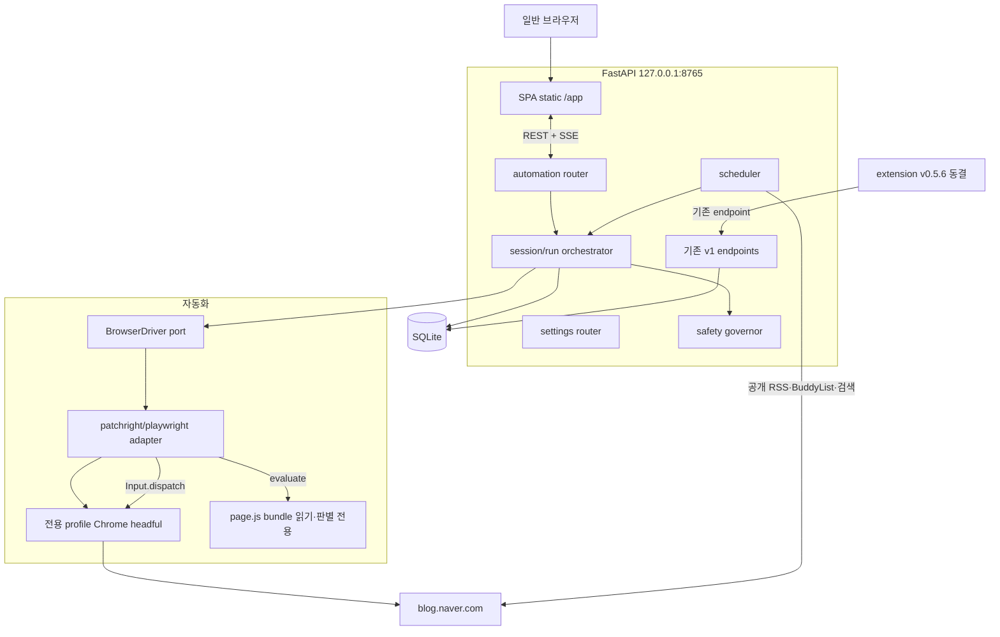
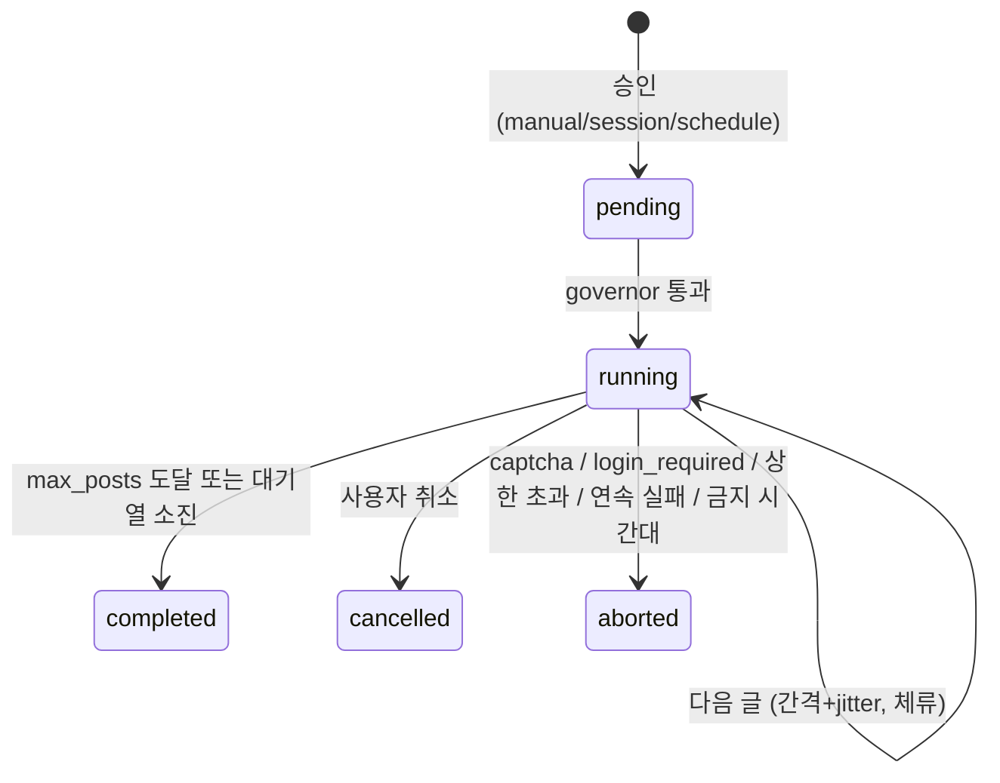

# 로컬 웹앱 + 브라우저 자동화 전환 Delivery Plan

Status: 진행 중, 2026-07-30 확정

Chrome extension Side Panel을 로컬 웹앱으로 옮기고, DOM 조작을 backend가 소유한 Playwright 계열
browser session으로 대체하는 전환 계획입니다. 기존 Side Panel 아키텍처는
[`architecture.md`](architecture.md)에, 이전 배포 경계는 [`delivery-plan.md`](delivery-plan.md)와
[`v0.5.1-engagement-delivery-plan.md`](v0.5.1-engagement-delivery-plan.md)에 남아 있습니다.

## 문제 정의

Chrome extension의 제약이 사용성과 확장성을 동시에 제한합니다. 좁은 Side Panel, MV3의 `activeTab`
user gesture 요구, service worker 수명, optional host permission 승인 흐름, extension ID와 CORS
origin 결합, unpacked 설치 절차가 그 목록입니다. 이를 FastAPI가 서빙하는 로컬 웹앱과 backend가
소유한 전용 profile browser session으로 옮기고, 승인 단위를 글 하나에서 세션으로 확대하며 최종적으로
무인 스케줄 실행까지 사용자가 선택할 수 있게 합니다. 기존 extension은 동결 상태로 계속 동작해야
합니다.

## 확정된 결정

| 항목 | 결정 |
| --- | --- |
| 실행 형태 | FastAPI가 서빙하는 로컬 웹앱 + backend가 소유한 전용 profile Chrome |
| 자동화 driver | `patchright` 기본, `playwright` fallback. `AUTOMATION_DRIVER` 설정으로 교체 |
| 동작 방식 | 읽기·판별은 isolated context evaluate, 클릭·입력은 CDP trusted input |
| 저장소 | 같은 저장소. `client/`와 automation 코드는 `extension/`을 참조하지 않아 이후 `git subtree split` 가능 |
| extension | v0.5.6 동결. 리팩터링하지 않음. 기존 table·endpoint 불변, 추가만 |
| 상태 저장 | 웹앱 상태는 SQLite 신규 table. extension의 `chrome.storage.local`은 그대로 유지 |
| 승인 모델 | `manual`(글 단위) → `session`(1차 목표) → `schedule`(최종, opt-in) |

### 결정 근거

**Electron 대신 로컬 웹앱.** 최종 목표가 무인 실행이므로 browser는 "사용자가 보는 창"이 아니라
backend가 소유하는 실행 자원입니다. 웹앱 구성에서는 API process만 살아 있으면 스케줄 실행이
가능하지만, Electron 구성에서는 앱이 실행 중이어야 하고 Python API를 child process로 관리하며 두
runtime의 생명주기를 맞춰야 합니다. Electron의 유일한 실질 이점인 "한 창에서 다 보인다"는
screenshot streaming과 창 focus 버튼으로 대체할 수 있고, 웹앱을 나중에 shell로 감싸는 것은 포장
작업에 그칩니다. 역방향 전환은 비쌉니다.

**`patchright` 기본.** Python 3.14 classifier를 명시하고 있어(`Requires-Python >=3.10`, 1.61.2 기준)
`requires-python = ">=3.14,<3.15"` 제약에서 오히려 설치 위험이 낮습니다. `Runtime.enable` 누출
회피와 `--enable-automation` 제거를 제공하며, 우리 사용 패턴이 isolated context DOM 조작이라 Console
API 비활성과 isolated 기본값 제약을 거의 받지 않습니다. extension도 이미 `world: "ISOLATED"`를
사용했습니다. `BrowserDriver` port 뒤에 두므로 되돌릴 수 있는 결정입니다.

**같은 저장소 유지.** Python backend 48개 파일이 그대로 재사용되고, SQLite file과 Alembic head는 단일
소유여야 하며(두 저장소가 각자 migration chain으로 한 file을 건드리면 데이터가 깨집니다), 두 UI가
하나의 API process를 공유해야 병행 운영이 가능하고, CI·release·hook이 이미 구축돼 있습니다. 분리
가능성은 `client/`와 automation 코드가 `extension/`을 참조하지 않는 규칙으로 유지합니다.

## 조사된 코드베이스 사실

- `src/naver_blog_assistant/` 48개 파일은 browser 비의존입니다. domain, application, SQLite(migration
  0001~0009), OpenAI adapter, discovery(BuddyList·RSS·검색 API·SMTP digest, FastAPI lifespan
  scheduler)가 그대로 재사용됩니다.
- `idempotency_records` table이 이미 서버에 있고 `Idempotency-Key` header와 `request_hash` 기반
  replay/conflict 의미를 서버가 소유합니다. extension의 `registry.ts`(388줄)는 서버 상태가 없던
  클라이언트를 보조한 것이므로 웹앱에서는 크게 단순화됩니다.
- `extension/src/browser/*`의 DOM 조작부(`probeLikeTarget`, `clickAndConfirmLikeTarget`,
  `naver-comment-publish-gateway.ts` 287줄, `naver-mutual-neighbor-gateway.ts` 1,080줄,
  `capture-current-frame.ts` 293줄)는 `chrome.scripting.executeScript` 직렬화 제약 때문에 helper를
  함수 내부에 중복 정의한 자기완결 함수입니다. `page.evaluate` 대상으로 이식 가능하며, 이식 시
  `isInteractable`·`readLikedState`·`findLikeTargets` 중복을 제거할 수 있습니다.
- `extension/src/api/client.ts`(1,403줄)는 순수 `fetch`입니다. `LOCAL_API_ORIGIN`만 상대 경로로 바꾸면
  SPA에서 재사용됩니다.
- `engagement_runs`(migration 0009)는 단계별 상태·결과 코드·forward-only 전이·`BEGIN IMMEDIATE`·unique
  제약을 이미 갖췄습니다. 자동화 엔진은 이를 재사용하고 trigger만 확장합니다.
- `scripts/cdp-evaluate.ps1`에 CDP `Runtime.evaluate` prototype이 있어 주입 방식이 검증돼 있습니다.
- 기존 OpenAPI 경로 20개는 수정하지 않습니다.

## 목표 아키텍처



## 디렉터리 구조

```
src/naver_blog_assistant/
├── api/
│   ├── factory.py                    # 기존. router 등록과 static mount만 추가
│   └── routers/                      # 신규
│       ├── automation.py             # session, extract, runs, sessions, SSE
│       ├── settings.py               # app_settings CRUD
│       └── spa.py                    # /app static mount
├── domain/
│   ├── automation.py                 # 신규: ActionOutcome, SessionPolicy, SafetyBudget, TriggerKind
│   └── (기존 models.py, discovery.py, engagement.py 불변)
├── ports/
│   ├── browser.py                    # 신규: BrowserDriver, BrowserSession, PageHandle
│   ├── clock.py                      # 신규: 시간·jitter 주입
│   └── repositories.py               # 신규 repository protocol 추가
├── application/
│   └── automation/                   # 신규
│       ├── extract_article.py
│       ├── execute_engagement.py     # 단일 글 실행
│       ├── run_session.py            # 세션 배치
│       ├── governor.py               # 상한·간격·중단 판정
│       └── errors.py
├── infrastructure/
│   ├── browser/                      # 신규
│   │   ├── driver_factory.py         # AUTOMATION_DRIVER 분기
│   │   ├── playwright_driver.py      # 공통 구현 (import만 교체)
│   │   ├── page_scripts.py           # bundle 로드·evaluate helper
│   │   ├── bundles/page.js           # 빌드 산출물, git 미추적
│   │   ├── naver/{article,like,comment,mutual_neighbor}.py
│   │   └── fake.py                   # 테스트용 driver
│   └── database/
│       ├── app_settings_repository.py
│       ├── automation_session_repository.py
│       └── migrations/versions/{0010,0011,0012}_*.py
client/                               # 신규 npm 프로젝트
├── package.json, biome.json, tsconfig.json, vitest.config.ts
├── scripts/build.mjs                 # app·page 두 entrypoint
├── public/index.html
├── src/
│   ├── app/                          # SPA
│   ├── page/                         # 주입 스크립트 (읽기·판별 전용)
│   └── shared/
└── tests/{app,page,fixtures}/
extension/                            # 동결. FROZEN 표기만 추가
```

`bundles/page.js`는 생성물이므로 커밋하지 않고 `.gitignore`에 넣습니다. `pyproject.toml`의
`force-include`에 등록하되(`docs/api/openapi.yaml` 선례와 같은 방식) wheel 빌드 전에
`npm --prefix client run build:page`가 선행돼야 하므로 CI와 `scripts/smoke_installed_wheel.py`에 존재
검사를 추가합니다.

## 데이터 모델

기존 table(`recommendations`, `comment_candidates`, `idempotency_records`, `discovery_*`,
`engagement_runs`)은 전부 불변입니다.

**migration 0010 `app_settings`**

| 컬럼 | 설명 |
| --- | --- |
| `kind` (PK) | `generation_profile`, `closing_phrase`, `neighbor_message`, `automation_consent`, `safety_policy`, `schedule_policy`, `browser_profile` |
| `schema_version` | 레코드별 버전. extension의 versioned record 개념 계승 |
| `payload_json` | 검증된 값만 |
| `updated_at` | ISO-8601 UTC |

**migration 0011 `automation_sessions`와 `engagement_runs` 확장**

`automation_sessions`: `id`, `trigger`(`manual`/`session`/`schedule`),
`state`(`pending`/`running`/`completed`/`aborted`/`cancelled`), `approved_steps_json`, `max_posts`,
`source_filter_json`, `processed_count`, `created_at`, `started_at`, `finished_at`, `abort_reason`.
`engagement_runs`에 nullable `session_id`와 `trigger` 추가하고 기존 행은 `manual`로 backfill합니다.

**migration 0012 `automation_activity_ledger`**

`(date, action)` 복합 PK와 `count`. discovery의 date idempotency ledger와 같은 패턴입니다.

## 신규 API 표면

기존 20개 operation은 수정하지 않고 아래를 추가합니다.

```
GET     /api/v1/automation/session
POST    /api/v1/automation/session/launch | /close | /focus
GET     /api/v1/automation/session/screenshot
POST    /api/v1/automation/extract
POST    /api/v1/automation/engagement-runs
GET     /api/v1/automation/engagement-runs/{id}/events        (SSE)
POST    /api/v1/automation/sessions
GET     /api/v1/automation/sessions/{id}
POST    /api/v1/automation/sessions/{id}/cancel
GET     /api/v1/automation/sessions/{id}/events               (SSE)
GET|PUT /api/v1/settings/{kind}
GET|PUT /api/v1/automation/safety-policy
GET|PUT /api/v1/automation/schedule
```

## 실행 모델



글 하나 안에서는 기존 `engagement_runs` 단계 상태 기계를 그대로 씁니다. 공감 → 댓글 → 서로이웃
순서, forward-only 전이, 성공·수동 완료 단계는 건너뛰고 `unconfirmed`는 자동 재시도하지 않습니다.

governor 파라미터: `daily_caps{like,comment,neighbor}`, `min_interval_seconds`, `jitter_ratio`,
`dwell_per_1000_chars`, `allowed_hours`, `max_consecutive_failures`, `skip_probability`.

## 보안·안전 경계

- 전용 profile 경로에서 headful Chrome을 실행합니다. 로그인은 사용자가 그 창에서 직접 수행하며
  ID·password 자동 입력을 하지 않고 cookie를 추출·재사용하지 않습니다.
- Captcha와 로그인 요구는 우회하지 않고 세션을 중단해 사람 개입을 기다립니다.
- Screenshot은 메모리로만 전달합니다. 본문과 계정 화면이 담기므로 disk·log·CI artifact에 저장하지
  않습니다.
- `OPENAI_API_KEY`와 `NAVER_SEARCH_*`는 Python process 환경에만 존재합니다.
- SPA는 same-origin이므로 CORS 완화가 필요 없습니다. extension용 origin 설정은 그대로 유지합니다.
- 무인 모드는 opt-in이며 UI에 계정 제한 위험을 명시합니다. governor 설정 없이는 활성화할 수 없습니다.
- UA, 언어, 시간대, 화면 크기를 조작하지 않습니다(`no_viewport=True`, custom header·user agent 금지).
  일관성이 은닉보다 낫습니다.

## 테스트 전략

| 계층 | 방법 | 게이트 |
| --- | --- | --- |
| domain·application | fake driver + fake clock으로 orchestrator·governor 단위 테스트 | pytest 85% branch |
| page scripts | jsdom + 합성 HTML (extension 테스트 이식) | Vitest 80% |
| SPA | jsdom, api client 계약 테스트 재사용 | Vitest 80% |
| 자동화 통합 | 로컬 fixture 서버 + 실제 driver headful. Linux CI는 xvfb | 별도 CI job |
| live 네이버 | opt-in 수동. 비용·계정 위험 문서화, artifact 금지 | 게이트 제외 |

### 테스트 강도 요구사항

커버리지 게이트 충족만으로는 부족하며 시나리오 다양성을 우선합니다.

- 정상 경로 외에 경계값, 빈 입력, 최대 길이 초과, 잘못된 enum, 잘못된 URL scheme·host,
  Unicode·emoji·surrogate pair, 공백 정규화, truncation 경계를 다룹니다.
- 실패 모드를 개별 테스트로 분리합니다: `not_found`, `ambiguous`, 이미 처리됨, `state_unknown`,
  권한 거부, stale page, captcha, login required, 네트워크 timeout, provider 거부, 5xx,
  429와 `Retry-After`.
- 동시성·재진입: 중복 클릭, 중복 요청, 동시 세션 시도, 진행 중 취소, process 재시작 후 `running`
  잔여 단계 처리.
- 상태 기계는 허용 전이와 금지 전이를 모두 테스트합니다.
- 시간 의존 로직은 fake clock으로 결정적으로 테스트합니다(jitter, 간격, 허용 시간대, 일일 상한
  경계, 자정 넘김).
- migration은 up/down 양방향과 기존 데이터 backfill을 테스트합니다.
- 테스트 이름은 관찰 가능한 행동으로 짓습니다(예: `test_timeout_reuses_original_idempotency_key`).
- fixture는 합성 HTML만 사용합니다.

### Task별 완료 검증 절차

각 Task를 끝낼 때마다 아래를 순서대로 실행해 출력으로 확인하고 결과를 해당 Task 항목에 기록합니다.
실패하면 다음 Task로 넘어가지 않습니다.

1. `uv run ruff format --check .`, `uv run ruff check .`, `uv run ty check`
2. `uv run pytest` (85% branch 게이트)
3. TypeScript 변경이 있으면 `npm --prefix client run check`
4. extension 무영향이 요구되는 Task는 `npm --prefix extension run check`
5. 해당 Task의 Demo 실행
6. 이 문서의 체크박스·상태·검증 결과·결정 로그 갱신

## PR 분할

| PR | Task | Conventional Commit | 상태 |
| --- | --- | --- | --- |
| 1 | 0 | `docs: add webapp automation delivery plan` | 완료 |
| 2 | 1+2 | `feat(automation): add browser driver port and session control` | 완료 |
| 3 | 3 | `feat(client): add page scripts package for naver dom probing` | 완료 |
| 4 | 4 | `feat(automation): extract article content through browser session` | 진행 |
| 5 | 5 | `feat(client): add local web app workspace shell` | 대기 |
| 6 | 6 | `feat(api): persist web app settings in sqlite` | 대기 |
| 7 | 7 | `feat(client): add comment generation and review workspace` | 대기 |
| 8 | 8 | `feat(automation): execute one approved engagement run` | 대기 |
| 9 | 9 | `feat(automation): add session-scoped engagement batches` | 대기 |
| 10 | 10 | `feat(automation): enforce safety budgets and abort conditions` | 대기 |
| 11 | 11 | `feat(automation): add opt-in unattended schedule mode` | 대기 |
| 12 | 12 | `test(automation): add integration suite and refresh docs` | 대기 |

CI 배선은 앞으로 당깁니다. PR 2에 Python automation 통합 job(Linux는 xvfb), PR 3에 `client/`
workspace 게이트를 `.github/workflows/ci.yml`에 추가합니다. PR 12는 fixture 서버 통합 스위트와 문서
개정만 담당합니다.

## Task 목록

### [x] Task 0 — 계획 문서 생성 (PR 1)

목표: 이 문서를 만들어 확정된 결정, 아키텍처, 데이터 모델, API 표면, 실행 모델, 보안 경계, 테스트
전략, Task 목록, 결정 로그, 미해결 검증 항목을 한곳에 둡니다. 이후 모든 PR이 같은 PR 안에서 이
문서를 갱신합니다.

Demo: 문서만 읽고 전체 작업 범위와 현재 진행 상태를 파악할 수 있습니다.

상태: 완료. 검증(2026-07-30): `ruff format --check` 82 files already formatted, `ruff check`
All checks passed, `ty check` All checks passed, `pytest` 349 passed / 3 skipped, total coverage
86.90%(게이트 85%).

### [x] Task 1+2 — driver 추상화와 browser session 관리 (PR 2)

목표: `ports/browser.py`에 `BrowserDriver`·`BrowserSession`·`PageHandle` protocol을 정의하고
`infrastructure/browser/`에 `fake.py`, `playwright_driver.py`(공통 구현, import만 교체),
`driver_factory.py`(`AUTOMATION_DRIVER=patchright|playwright`)를 추가합니다. profile 경로 결정,
launch·close·focus, 로그인 상태 판별, screenshot, 동시 실행 방지 lock을 구현하고
`automation/session` endpoint군을 추가합니다.

구현 지침: `patchright`를 정확 버전으로 pin합니다. `channel="chrome"`,
`launch_persistent_context`, `no_viewport=True`를 사용하고 custom header·user agent를 넣지 않습니다.

테스트 요건: fake driver 단위 테스트, 세션 상태 전이의 허용·금지 전이, 중복 launch 거부, 진행 중
close, 플랫폼별 profile 경로 결정, 로그인 판별 3분기(로그인·비로그인·판별 불가), screenshot 실패,
`about:blank` 대상 통합 테스트.

Demo: 웹 요청으로 전용 profile Chrome을 띄우고 `navigator.webdriver` 값과 로그인 화면 screenshot을
받습니다. 로그인 후 상태가 `authenticated`로 바뀝니다.

상태: 완료. 검증(2026-07-30): `ruff format --check`·`ruff check`·`ty check` All checks passed,
`pytest` 495 passed / 7 skipped, total coverage 88.45%. 신규 모듈 커버리지는 `ports/browser.py`
100%, `domain/automation.py` 100%, `application/automation/session.py` 99%,
`infrastructure/browser/playwright_driver.py` 100%, `api/routers/automation.py` 100%.

Demo 실행 결과: `uv run python -m scripts.browser_smoke --headless --channel ""` →
`driver=patchright`, `state=ready`, `navigator.webdriver=False`, `screenshot_bytes=2727`.
실제 Chromium 통합 테스트 4건 통과(`patchright`), `playwright` 변형 4건은 fallback 미설치로 skip.

### [x] Task 3 — page-scripts 패키지와 읽기·판별 전용 이식 (PR 3)

목표: `client/`를 신설하고 extension의 DOM 로직과 jsdom 테스트를 복사합니다. `.click()` 호출을
제거해 대상 식별 정보(frame, selector, 상태)만 반환하는 형태로 정리하고 중복 helper를 `dom.ts`로
통합합니다. esbuild가 `app`과 `page` 두 entrypoint를 빌드하고 `page.js`를
`infrastructure/browser/bundles/`로 산출합니다.

테스트 요건: 이식한 Vitest suite 전부 통과에 더해 숨은 중복 control, 비활성 control, 반응 레이어,
shadow root, 다중 frame, 작성자 불일치, 입력란 이미 채워짐 시나리오를 추가합니다. Python에서
bundle을 evaluate해 fixture HTML에서 대상 탐지 결과를 얻는 통합 테스트를 포함합니다.

Demo: 합성 HTML에서 공감 control, 댓글 입력란, 서로이웃 진입점을 찾아 상태와 selector를 반환합니다.

상태: 완료. 검증(2026-07-30): `npm --prefix client run check` → Biome format·lint, tsc, Vitest
**133 passed**, coverage statements 94% / branches 87.11%(게이트 80%), build 성공(`page.js` 30.4kb).
`uv run pytest` **511 passed / 7 skipped**, total coverage 88.61%,
`infrastructure/browser/page_scripts.py` 100%. 실제 Chromium에서 bundle 통합 테스트 5건 통과
(probe 코드 일치, selector가 live 문서에서 1개로 resolve, navigation 후 자동 재설치, 무관한 문서에서
fail-closed, iframe 개별 probe). wheel에 `page.js`와 `openapi.yaml`이 포함되고
`scripts/smoke_installed_wheel.py`가 bundle의 모든 probe 존재를 확인합니다.

Demo 실행 결과: `python -m scripts.browser_smoke --headless --channel "" --probe --url <합성 HTML>` →
`article=modern`, `like=ready`, `comment=ready`, `neighbor=can_request`.

### [x] Task 4 — 본문 추출 파이프라인 (PR 4)

목표: 탭 열기 → 로드 대기 → frame 순회 → 랭킹 → 정규화 → 100,000 code point 제한을 연결하고
`POST /automation/extract`를 추가합니다. 비지원 URL, 이미지 전용, 과소 분량은 fail-closed입니다.

테스트 요건: 다중 frame 랭킹, 짧은 글, 이미지 전용, 비지원 scheme·host, truncation 경계(제한
직전·직후), Unicode·emoji 정규화, 로드 timeout, navigation 중 변경.

Demo: 네이버 글 URL로 title, 글자수, truncation 여부, preview를 반환합니다.

상태: 완료. 검증(2026-07-30): `ruff format --check` 112 files, `ruff check`·`ty check` All checks
passed, `pytest` **587 passed / 7 skipped**, total coverage 88.9% 이상.
`application/automation/extract_article.py` 100%, `domain/automation.py` 100%,
`infrastructure/browser/page_scripts.py` 100%, `api/routers/automation.py` 98%.
단위 테스트 51건(URL 허용·거부 17종, 공백·emoji 정규화, frame 랭킹 3종, 경계 길이, page/서버 truncation
구분, 신뢰할 수 없는 숫자 필드 강제 변환), endpoint 테스트 13건(세션 미실행 409, 지원하지 않는 URL 422,
스키마 위반 422, empty/short/extraction_failed, bundle 누락 503, 응답에 본문 미포함).

### [ ] Task 5 — SPA skeleton과 오늘의 작업 (PR 5)

목표: `client/src/app`에 SPA를 만들고 `api/client.ts`를 복사해 상대 경로로 조정합니다. FastAPI가
`/app`에 정적 파일을 서빙합니다. 넓은 화면 전제로 대기열과 상세를 동시에 표시합니다.

테스트 요건: 상태 전이·렌더링, api client 계약 테스트 재사용, 서비스 미가동, 빈 대기열, 응답 스키마
위반, 접근성(키보드 이동·label).

Demo: `http://127.0.0.1:8765/app`에서 서비스 상태, source별 대기열 수, 대기열 목록을 봅니다.

상태: 대기.

### [ ] Task 6 — 웹앱 설정을 SQLite로 (PR 6)

목표: migration 0010 `app_settings`와 `settings/{kind}` endpoint를 추가하고 생성 preference, 마무리
문구(최대 50 code point), 서로이웃 기본 메시지(최대 500 code point), 자동 실행 동의를 이전합니다.

테스트 요건: kind별 스키마 검증, 길이 경계(50/51, 500/501), 잘못된 enum, `schema_version`
상·하위 호환, 알 수 없는 kind 거부, migration up/down, extension 회귀.

Demo: 웹앱에서 설정을 저장하고 API 재시작 후에도 유지됩니다. extension도 자기 설정으로 정상
동작합니다.

상태: 대기.

### [ ] Task 7 — 댓글 생성·검토 화면 (PR 7)

목표: 추출 → 옵션 확인 → 생성 → 후보 선택·편집 → 마무리 문구 부착을 SPA에 구현하고 idempotency key
발급과 재시도 상태를 서버가 소유하도록 옮깁니다. timeout·indeterminate 시 자동으로 새 key를
발급하지 않는 기존 정책을 유지합니다.

테스트 요건: 중복 요청, 완료·실패 스냅샷 replay, 동일 digest 재생성, digest 변경 시 Preview 복귀,
timeout 후 복구 안내, 429와 `Retry-After`, provider 거부, 편집 길이 제한, 마무리 문구 부착 위치.

Demo: 웹앱만으로 글 하나의 후보를 생성하고 다듬어 승인 상태로 만듭니다.

상태: 대기.

### [ ] Task 8 — 단일 글 실행 엔진과 SSE (PR 8)

목표: 공감 → 댓글 → 서로이웃을 순서대로 실행합니다. 대상 탐지는 evaluate, 클릭·타이핑은 trusted
input(`Input.dispatchMouseEvent`, `Input.dispatchKeyEvent`)으로 수행합니다. 기존 `engagement_runs`에
기록하고 단계 진행을 SSE로 전송합니다.

테스트 요건: 결과 코드 전 조합, 이미 공감됨, 모호한 대상, 작성자 불일치, popup 미출현·다중 popup,
기본 이웃만 가능, captcha placeholder 오탐 방지, 중단 후 재실행 시 성공 단계 skip, `running` 잔여
단계를 `unconfirmed`로 전환, SSE 연결 끊김 후 재연결.

Demo: 버튼 한 번으로 글 하나를 처리하고 단계별 진행과 결과 코드를 실시간으로 봅니다.

상태: 대기.

### [ ] Task 9 — 세션 단위 승인 배치 (PR 9)

목표: migration 0011로 `automation_sessions`와 `engagement_runs.session_id`·`trigger`를 추가하고
승인 1회로 대기열 N개를 순차 처리하며 언제든 취소할 수 있게 합니다.

테스트 요건: 순차 처리, 중간 취소, 부분 실패 후 요약, 동시 세션 거부, `max_posts` 경계, 대기열
소진, 승인 단계 외 실행 거부, 세션 상태 금지 전이, backfill 검증.

Demo: 대기열 5개를 한 번 승인해 순차 처리하고 3번째에서 취소하면 남은 글은 건드리지 않습니다.

상태: 대기.

### [ ] Task 10 — safety governor (PR 10)

목표: migration 0012 `automation_activity_ledger`와 함께 일일 상한, 최소 간격과 jitter, 본문 길이
비례 체류·스크롤, 허용 시간대, 연속 실패 차단, 간헐적 skip을 구현하고 중단 사유를 기존 SMTP
digest로 알립니다.

테스트 요건: 상한 경계(직전·도달·초과), 자정 넘김, jitter 범위, 허용 시간대 경계, 연속 실패 임계,
captcha·login_required 즉시 중단, 알림 발송 실패 시 세션 상태 보존.

Demo: captcha fixture에서 세션이 즉시 중단되고 알림이 발송됩니다. 상한 도달 후 실행이 거부됩니다.

상태: 대기.

### [ ] Task 11 — 무인 스케줄 모드 (PR 11)

목표: 기존 discovery scheduler를 확장해 저장된 정책대로 세션을 자동 생성·실행합니다. 활성화 시 위험
고지와 명시적 동의를 요구하고 governor 설정 없이는 활성화할 수 없게 합니다.

테스트 요건: 시각 trigger, 중복 실행 방지(date ledger 재사용), 동의 없음 거부, governor 미설정 거부,
스케줄 시각에 browser 미실행 시 자체 launch, 로그인 만료 시 중단·알림, process 재시작 시 미완 세션
처리.

Demo: 테스트 시각 설정 후 사람 개입 없이 세션이 생성·실행되고 결과가 기록됩니다.

상태: 대기.

### [ ] Task 12 — 통합 스위트, 경계 규칙, 문서 개정 (PR 12)

목표: fixture 서버 기반 통합 테스트를 정리하고, `client/`와 automation 코드가 `extension/`을 import
하지 않도록 tsconfig 경계와 CI 검사를 추가합니다. `architecture.md`의 보안 경계, `README.md`,
`local-operations.md`, `api-contract.md`, `docs/api/openapi.yaml`을 개정하고 extension을 FROZEN으로
표기합니다.

테스트 요건: 전체 게이트 통과와 import 경계 검사 실패 케이스.

Demo: CI 전 job green. 문서만 보고 fresh 환경에서 웹앱 세팅 완료.

상태: 대기.

## 결정 로그

| 날짜 | 결정 | 비고 |
| --- | --- | --- |
| 2026-07-30 | 로컬 웹앱 + backend 소유 browser session으로 전환 | Electron은 무인 실행에서 이득 없이 이중 runtime 부담 |
| 2026-07-30 | `patchright` 기본, `playwright` fallback | Python 3.14 classifier 명시, `Runtime.enable` 누출 회피 |
| 2026-07-30 | 같은 저장소 유지, 분리 가능성만 확보 | SQLite·Alembic 단일 소유, 단일 API process 공유 |
| 2026-07-30 | extension v0.5.6 동결, DOM 로직은 복사해 이식 | 추출·공유 refactor의 회귀 위험 회피 |
| 2026-07-30 | 클릭·입력은 trusted input, evaluate는 읽기·판별 전용 | `element.click()`은 `isTrusted=false`이며 일부 handler에서 무시됨 |
| 2026-07-30 | 웹앱 상태는 SQLite 신규 table, extension storage는 유지 | 무인 스케줄러가 서버에서 설정을 읽어야 함 |
| 2026-07-30 | `patchright==1.61.2`를 runtime dependency로 pin | Python 3.14에서 설치·실행 확인. wheel만 배포되며 45MB |
| 2026-07-30 | CI 자동화 job은 headless로 실행 | 사용자 흐름은 headful이지만 CI 안정성을 위해 headless를 사용하고 `xvfb-run`으로 감쌈 |
| 2026-07-30 | `AUTOMATION_BROWSER_CHANNEL`은 비울 수 있음 | `chrome` 채널은 실제 Google Chrome 설치가 필요하고, 없으면 bundled Chromium을 사용 |
| 2026-07-30 | 세션 상태 전이는 lock 없이 event loop 단일 스레드 전제로 동기 설정 | 진행 중 재요청은 `browser_session_busy`로 즉시 거부해 결정적으로 동작 |
| 2026-07-30 | 로그인 판별은 공개 페이지의 로그인·로그아웃 링크만 관찰 | cookie·credential을 읽지 않으며 판별 불가 시 `unknown`으로 fail closed |
| 2026-07-30 | 지원 host 검사를 page script에서 Python 계층으로 이동 | 같은 script로 합성 fixture를 검증할 수 있고 host 정책은 서버가 단독 소유 |
| 2026-07-30 | page script는 selector만 반환하고 클릭·입력은 하지 않음 | `elementSelector`가 document-unique CSS path를 만들고 Python이 trusted input으로 조작 |
| 2026-07-30 | `page.js`는 커밋하지 않고 wheel `force-include`로 포함 | 생성물 비커밋 규칙 유지. CI와 wheel smoke가 존재와 probe 목록을 검사 |
| 2026-07-30 | CI에 `Client quality` job과 extension 참조 금지 검사 추가 | 이후 `git subtree split`이 가능한 경계를 자동으로 유지 |
| 2026-07-30 | `truncated`를 파생 속성에서 명시 필드로 변경 | 정규화로 짧아진 것을 truncation으로 보고하던 extension의 오탐을 제거 |
| 2026-07-30 | `PageScriptRunner`는 bundle을 지연 로딩 | bundle이 없어도 앱이 기동하고 추출 시점에 503 `browser_unavailable`로 실패 |

## 미해결 검증 항목

- ~~`patchright`가 sdist 없이 wheel만 배포하므로 uv가 대상 플랫폼 wheel을 해석하는지, Python
  3.14에서 설치되는지~~ → 해결. `uv add "patchright==1.61.2"`가 Python 3.14.4에서 성공하고
  `navigator.webdriver`가 `False`로 관측됩니다(Task 1+2).
- `AUTOMATION_BROWSER_CHANNEL=chrome`은 실제 Google Chrome 설치가 필요합니다. 미설치 환경에서는
  `BrowserType.launch_persistent_context: Chromium distribution 'chrome' is not found` 오류가
  발생하므로 값을 비워 bundled Chromium을 사용합니다.
- `patchright`와 `channel="chrome"` persistent context 조합에서 서로이웃 popup 흐름이 동작하는지
  (Task 8에서 확인).
- trusted input에 대한 네이버 반응 레이어·에디터의 실제 반응. 합성 fixture로 완전 검증이 불가하므로
  live opt-in 확인이 필요합니다.
- CDP `Input.dispatch*` 자체도 탐지 가능한 흔적을 남깁니다. Brotector는 CDP-Patches 병용 시 통과하는
  것으로 보고돼 있습니다. 필요해지면 OS 레벨 입력이 escalation 경로이나 창 focus 요구와 OS 의존성
  때문에 현재는 채택하지 않습니다.
- 무인 모드의 계정 제한 위험은 어떤 기술적 대책으로도 제거되지 않습니다. 네이버 약관은 매크로성 자동
  접근을 제한하며 실제 집행은 서버측 활동량 제한과 어뷰징 휴리스틱으로 이루어집니다. 네이버
  고객센터에 "댓글과 공감 활동의 제한 안내" 문서가 존재하는 것을 확인했습니다.
